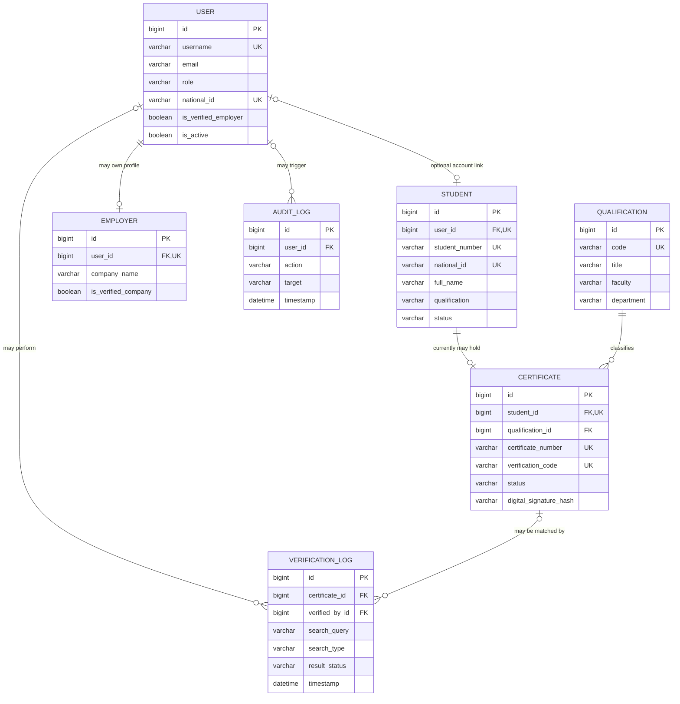
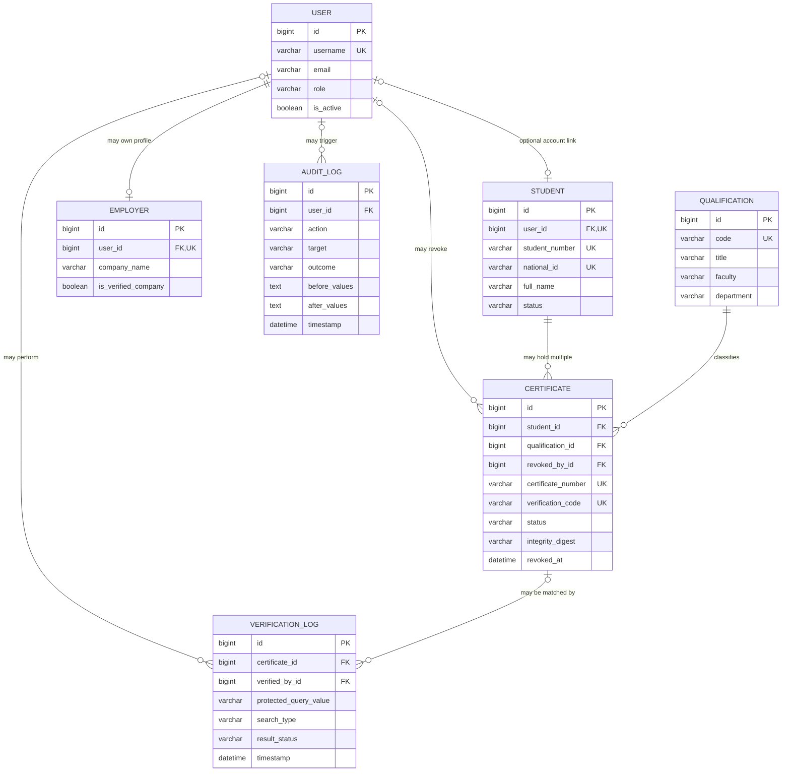

# Database Entity-Relationship Design and Data Dictionary

## Midlands State University Qualification Verification System

| Document item | Value |
|---|---|
| Module | MIM736 – Software Engineering |
| Assignment | DevOps-Enabled Qualification Verification System Using Git and CI/CD Practices |
| Related specification | `docs/REQUIREMENTS.md`, version 0.2 |
| Related traceability matrix | `docs/REQUIREMENTS_TRACEABILITY_MATRIX.md`, version 0.2 |
| Document version | 0.2 – Updated team-review draft |
| Schema baseline date | 10 September 2026 |
| Document owner | Database and Registry Lead, supported by the project team |
| Approval status | Pending team review and project-lead approval |

## Document control

| Version | Date | Change | Prepared by | Approval |
|---|---|---|---|---|
| 0.1 | 9 September 2026 | Initial ERD and field-level dictionary derived from Django models and migrations | Project team | Pending |
| 0.2 | 10 September 2026 | Updated implementation baseline, evidence and remaining work; retained requirement identifiers | Artwell (`artwel-dev`), with Codex assistance | Pending team review |

## Review baseline and interpretation

Reviewed on **10 September 2026** against `develop` at `77df668f0cb5a0e81118a63ce1439f36ca42cf8c` and the documentation in [PR #8](https://github.com/unclechipaz/qualification_verification_system/pull/8), head `ebc9594e49e17c40678f49c1d9e109753955e62b`. The application code is the same at these two revisions; PR #8 contains documentation changes and was **open, not merged**, when checked.

[PR #4](https://github.com/unclechipaz/qualification_verification_system/pull/4) repaired CI. [PR #6](https://github.com/unclechipaz/qualification_verification_system/pull/6) restricted public registration, applied password validation and checked login redirect destinations; it addresses [issue #5](https://github.com/unclechipaz/qualification_verification_system/issues/5). Both fixes are merged into `develop`. The [develop CI run](https://github.com/unclechipaz/qualification_verification_system/actions/runs/34408020848) and [PR #8 CI run](https://github.com/unclechipaz/qualification_verification_system/actions/runs/34471626306) completed successfully, including Django checks, migration-drift checking, pytest and Docker image building. These runs do not establish coverage, static analysis, PostgreSQL integration, deployment or complete security acceptance.

**Target versus current behaviour:** requirements, proposed controls and unchecked acceptance lists below describe work to deliver or approve. They are not claims of implementation or team sign-off. The assignment requires the four core capabilities, Git collaboration, CI/CD and quality evidence; detailed schema, role, hosting and numerical thresholds in this draft are proposed project decisions unless explicitly attributed to the brief. No additional assessment marks or lecturer requirements are inferred.

These findings apply to the inspected revisions. They do not establish the state of `main`, a live deployment or later commits. Refresh the evidence before release.

## 1. Purpose

This document defines the database structure used by the MSU Qualification Verification System (MSU QVS). It provides:

- an accurate current-state entity-relationship diagram based on the repository;
- a corrected target-state design aligned with the Software Requirements Specification (SRS);
- a field-level data dictionary;
- key, index, validation and deletion rules;
- data-classification and disclosure requirements; and
- a controlled migration plan for identified schema defects.

The current and target diagrams are deliberately separated. The current diagram describes what the code creates today. The target diagram describes proposed changes requiring team approval and implementation; it is not an applied migration or an approved institutional schema.

## 2. Scope and notation

### 2.1 Included domain tables

| Django model | Physical table | Source model |
|---|---|---|
| `authentication.User` | `authentication_user` | `backend/authentication/models.py` |
| `students.Student` | `students_student` | `backend/students/models.py` |
| `qualifications.Qualification` | `qualifications_qualification` | `backend/qualifications/models.py` |
| `qualifications.Certificate` | `qualifications_certificate` | `backend/qualifications/models.py` |
| `employers.Employer` | `employers_employer` | `backend/employers/models.py` |
| `verification.VerificationLog` | `verification_verificationlog` | `backend/verification/models.py` |
| `audit.AuditLog` | `audit_auditlog` | `backend/audit/models.py` |

Django-managed tables for permissions, groups, sessions, admin history, migrations and REST tokens also exist. They are platform-supporting tables and are excluded from the main domain ERD. The `User.groups` and `User.user_permissions` many-to-many relationships are implemented through Django-managed junction tables.

### 2.2 Notation

| Abbreviation | Meaning |
|---|---|
| PK | Primary key |
| FK | Foreign key |
| UQ | Unique constraint |
| IX | Database index |
| NN | Database value may not be null |
| NULL | Database value may be null |
| 1:1 | One-to-one relationship |
| 1:N | One-to-many relationship |

Blank strings and database nulls are different. A Django field marked `blank=True` may accept an empty form value even when its database column is non-null.

## 3. Current physical schema

The following diagram reflects the relationships in the current Django migrations.

### 3.1 Current relationship catalogue

| Parent | Child | Current cardinality | Django field | On-delete rule | Meaning |
|---|---|---|---|---|---|
| User | Student | 0..1 to 0..1 | `Student.user` | `SET_NULL` | A graduate account may be linked to one student profile; deleting the account retains the academic record. |
| User | Employer | 1 to 0..1 | `Employer.user` | `CASCADE` | An employer profile belongs to one user; deleting the user currently deletes the employer profile. |
| User | VerificationLog | 1 to 0..N | `VerificationLog.verified_by` | `SET_NULL` | Authenticated verification activity may identify its verifier; anonymous activity has no user. |
| User | AuditLog | 1 to 0..N | `AuditLog.user` | `SET_NULL` | An audit event may identify an authenticated actor; deletion of the account retains the audit record. |
| Student | Certificate | 1 to 0..1 | `Certificate.student` | `CASCADE` | Current schema allows no more than one certificate for each student and deletes it with the student. |
| Qualification | Certificate | 1 to 0..N | `Certificate.qualification` | `PROTECT` | A qualification cannot be deleted while a certificate references it. |
| Certificate | VerificationLog | 1 to 0..N | `VerificationLog.certificate` | `SET_NULL` | A verification may reference a certificate; invalid checks and retained logs may have no certificate. |

## 4. Target logical schema

The target design corrects the cardinality, auditability and data-minimisation gaps identified in DR-03, DR-07, DR-08 and DR-12 of the SRS. It is a controlled proposal; the team shall approve it before generating migrations.

### 4.1 Target design decisions

| Decision | Target rule | Reason |
|---|---|---|
| Student-to-certificate cardinality | Change `Certificate.student` from 1:1 to 1:N. | One graduate may hold multiple qualifications or certificates. |
| Academic-record deletion | Protect issued certificates and their parent student records from ordinary hard deletion; use controlled status changes and retention. | Cascading deletion can destroy credential and audit evidence. |
| Qualification source | Proposed: `Certificate.qualification` becomes the authoritative awarded qualification. | Avoid conflict with the free-text `Student.qualification` field. |
| National ID source | `Student.national_id` should be authoritative for the academic record. | The current User and Student duplication can become inconsistent. |
| Email login identity | Enforce normalised email uniqueness or discontinue email as a login identifier. | The current view supports email login while the database permits duplicate emails. |
| Employer approval source | `Employer.is_verified_company` should be authoritative, or one field must be strictly synchronised. | User and Employer currently duplicate the same approval concept. |
| Certificate integrity | Rename the current hash to `integrity_digest` unless genuine asymmetric signing is implemented. | A SHA-256 digest alone is not a digital signature. |
| Revocation accountability | Add nullable `revoked_by` and `revoked_at`; require them and a reason when status is Revoked. | Supports DR-07 and auditability. |
| Verification query storage | Store a masked value or keyed fingerprint for restricted query types. | Reduces National ID and personal-data exposure in logs. |
| Administrative audit detail | Add outcome and safe before/after data for high-risk changes. | A path and HTTP status alone are insufficient evidence of the changed record. |

## 5. Current-state data dictionary

### 5.1 User — `authentication_user`

| Field/column | Type | Null/default | Keys/indexes | Classification | Definition |
|---|---|---|---|---|---|
| `id` | BigAutoField | NN; generated | PK | Internal | Surrogate user identifier. |
| `username` | varchar(150) | NN | UQ | Internal | Login name; validated by Django. |
| `password` | varchar(128) | NN | — | Secret | Django password hash; never a plaintext password. |
| `first_name` | varchar(150) | NN; blank allowed | — | Restricted | User's given name. |
| `last_name` | varchar(150) | NN; blank allowed | — | Restricted | User's surname. |
| `email` | varchar(254) | NN; blank allowed | Not unique | Restricted | Email address used by the login view as an alternative identifier. |
| `last_login` | datetime | NULL | — | Internal | Most recent Django login time. |
| `is_superuser` | boolean | NN; `False` | — | Security-sensitive | Grants all Django permissions. |
| `is_staff` | boolean | NN; `False` | — | Security-sensitive | Permits access to Django Admin when other checks pass. |
| `is_active` | boolean | NN; `True` | — | Security-sensitive | Enables or disables authentication without deleting the account. |
| `date_joined` | datetime | NN; current time | — | Internal | Django account-creation time. |
| `role` | varchar(20) | NN; `PUBLIC_VERIFIER` | — | Security-sensitive | Application role: Administrator, Registrar, Graduate, Employer or Public Verifier. |
| `national_id` | varchar(50) | NULL | UQ | Restricted | Optional National ID stored on the user account; duplicates the Student concept. |
| `phone_number` | varchar(20) | NULL | — | Restricted | Optional contact number. |
| `organization_name` | varchar(150) | NULL | — | Internal | Optional organisation name, primarily for employer users. |
| `is_verified_employer` | boolean | NN; `False` | — | Security-sensitive | User-level employer approval flag; duplicates Employer approval state. |
| `created_at` | datetime | NN; generated | — | Internal | Custom record-creation timestamp. |
| `updated_at` | datetime | NN; generated | — | Internal | Last model-save timestamp. |
| `groups` | many-to-many | Empty allowed | FK junction table | Security-sensitive | Django permission groups assigned to the user. |
| `user_permissions` | many-to-many | Empty allowed | FK junction table | Security-sensitive | Direct Django permissions assigned to the user. |

**Current integrity concern:** `email` is not database-unique. The web registration view checks duplicates, but another path could create duplicate emails and make email login ambiguous. The team shall either enforce normalised uniqueness or stop treating email as a login identifier.

### 5.2 Student — `students_student`

| Field/column | Type | Null/default | Keys/indexes | Classification | Definition |
|---|---|---|---|---|---|
| `id` | BigAutoField | NN; generated | PK | Internal | Surrogate student-record identifier. |
| `user_id` | bigint | NULL | FK, UQ | Restricted | Optional link to one graduate User; `SET_NULL` on account deletion. |
| `student_number` | varchar(30) | NN | UQ, IX | Restricted | Institution-issued student identifier. |
| `national_id` | varchar(50) | NN | UQ, IX | Restricted | National identity number; must be masked outside approved internal use. |
| `full_name` | varchar(150) | NN | IX | Restricted | Student's full name. |
| `programme` | varchar(150) | NN | — | Controlled disclosure | Programme description. |
| `faculty` | varchar(150) | NN | — | Controlled disclosure | Faculty responsible for the programme. |
| `level` | varchar(30) | NN; `Undergraduate` | — | Controlled disclosure | Undergraduate, Postgraduate, Doctorate or Diploma. |
| `graduation_date` | date | NN | — | Controlled disclosure | Recorded date of graduation. |
| `qualification` | varchar(200) | NN | — | Controlled disclosure | Free-text awarded qualification; duplicates the linked Qualification concept. |
| `degree_classification` | varchar(50) | NN | — | Restricted | First Class, Upper Second, Lower Second, Pass, Distinction or Merit. |
| `status` | varchar(20) | NN; `Graduated` | — | Internal | Active, Graduated, Revoked or Suspended student status. |
| `created_at` | datetime | NN; generated | — | Internal | Record-creation time. |
| `updated_at` | datetime | NN; generated | — | Internal | Last model-save time. |

**Current normalisation concern:** the free-text `qualification` and `programme` values can disagree with `Certificate.qualification`. The target design shall identify one authoritative qualification source.

### 5.3 Qualification — `qualifications_qualification`

| Field/column | Type | Null/default | Keys/indexes | Classification | Definition |
|---|---|---|---|---|---|
| `id` | BigAutoField | NN; generated | PK | Internal | Surrogate qualification identifier. |
| `title` | varchar(200) | NN | — | Controlled disclosure | Official qualification title. |
| `code` | varchar(50) | NN | UQ | Controlled disclosure | Unique internal qualification code. |
| `faculty` | varchar(150) | NN | — | Controlled disclosure | Owning faculty. |
| `department` | varchar(150) | NN | — | Controlled disclosure | Owning department. |
| `duration_years` | integer | NN; `4` | — | Internal | Nominal duration in years. |
| `description` | text | NULL | — | Internal | Optional qualification description. |
| `created_at` | datetime | NN; generated | — | Internal | Record-creation time. |

### 5.4 Certificate — `qualifications_certificate`

| Field/column | Type | Null/default | Keys/indexes | Classification | Definition |
|---|---|---|---|---|---|
| `id` | BigAutoField | NN; generated | PK | Internal | Surrogate certificate identifier. |
| `student_id` | bigint | NN | FK, UQ | Restricted | Current one-to-one link to Student; `CASCADE` on student deletion. |
| `qualification_id` | bigint | NN | FK, IX | Controlled disclosure | Qualification awarded; `PROTECT` prevents deletion while referenced. |
| `certificate_number` | varchar(50) | NN | UQ, IX | Controlled public identifier | Institution-issued certificate reference. |
| `verification_code` | varchar(64) | NN; UUID generator | UQ, IX | Controlled public identifier | Unpredictable value encoded in verification links/QR codes. |
| `issue_date` | date | NN | — | Controlled disclosure | Date the certificate was issued. |
| `qr_code_image` | varchar(100) path | NULL | — | Internal | Media path for an optional generated QR image; database does not store image bytes. |
| `status` | varchar(20) | NN; `ACTIVE` | — | Controlled disclosure | ACTIVE, REVOKED or SUSPENDED. |
| `revocation_reason` | text | NULL | — | Restricted | Reason for revocation; currently not required when status is REVOKED. |
| `digital_signature_hash` | varchar(128) | NULL | — | Internal | SHA-256 text digest generated from selected fields; not a digital signature. |
| `created_at` | datetime | NN; generated | — | Internal | Record-creation time. |
| `updated_at` | datetime | NN; generated | — | Internal | Last model-save time. |

**Current issuance and digest behaviour:** the certificate API omits the read-only number and lets `save()` generate it. The current Django Admin form requires a certificate number. Saving a Student alone issues no certificate. The hash input is `certificate_number:student_number:national_id:issue_date`, encoded as UTF-8 and hashed with SHA-256. It is generated only when the field is blank, is not recomputed on every update and is not checked during verification. Historical PDFs combine a saved log outcome with current related record details; they are not immutable historical snapshots.

**Current generation concern:** certificate numbers use the current record count plus one. Concurrent issuance or record deletion can cause collisions. Generation shall use a database-safe sequence or retry-safe unique scheme.

### 5.5 Employer — `employers_employer`

| Field/column | Type | Null/default | Keys/indexes | Classification | Definition |
|---|---|---|---|---|---|
| `id` | BigAutoField | NN; generated | PK | Internal | Surrogate employer-profile identifier. |
| `user_id` | bigint | NN | FK, UQ | Restricted | One-to-one owner User; `CASCADE` on user deletion. |
| `company_name` | varchar(150) | NN | — | Internal | Employer organisation name. |
| `industry` | varchar(100) | NULL | — | Internal | Optional industry category. |
| `contact_person` | varchar(100) | NN | — | Restricted | Authorised employer contact. |
| `contact_email` | varchar(254) | NN | — | Restricted | Employer contact email. |
| `contact_phone` | varchar(30) | NN | — | Restricted | Employer contact telephone number. |
| `is_verified_company` | boolean | NN; `False` | — | Security-sensitive | Employer-profile approval flag. |
| `created_at` | datetime | NN; generated | — | Internal | Profile-creation time. |

**Current provisioning behaviour:** public registration creates only a User, without an Employer profile or a linked Student. An authorised administrator must create/link those records. Application role values do not grant Django Admin model permissions: `is_staff` plus the relevant permissions, or a superuser account, are needed.

**Current approval concern:** `Employer.is_verified_company` and `User.is_verified_employer` can disagree. One shall become authoritative and employer access shall check that approved value.

### 5.6 VerificationLog — `verification_verificationlog`

| Field/column | Type | Null/default | Keys/indexes | Classification | Definition |
|---|---|---|---|---|---|
| `id` | BigAutoField | NN; generated | PK | Internal | Unique verification-event identifier. |
| `search_query` | varchar(150) | NN | — | Restricted | Raw submitted query; may currently contain a National ID or name. |
| `search_type` | varchar(30) | NN; `CERTIFICATE_NUMBER` | — | Internal | CERTIFICATE_NUMBER, STUDENT_NUMBER, VERIFICATION_CODE, QR_CODE, NATIONAL_ID or NAME. |
| `result_status` | varchar(20) | NN | — | Internal | VERIFIED, INVALID, REVOKED or PENDING. |
| `certificate_id` | bigint | NULL | FK, IX | Restricted | Matched Certificate; `SET_NULL` if removed and null for invalid searches. |
| `verified_by_id` | bigint | NULL | FK, IX | Restricted | Authenticated verifier; null for anonymous requests or after user deletion. The log row remains, but the actor link is cleared. |
| `ip_address` | IP address | NULL | — | Restricted | Source address inferred from request metadata. |
| `user_agent` | text | NULL | — | Restricted | Browser/client identification string. |
| `is_suspicious` | boolean | NN; `False` | — | Internal | Rule-based anomaly flag. |
| `fraud_reason` | text | NULL | — | Restricted | Rule explanation; an indicator, not proof of fraud. |
| `anomaly_score` | integer | NN; `0` | — | Internal | Rule-based score intended to remain between 0 and 100; no database check currently enforces the range. |
| `timestamp` | datetime | NN; generated | — | Internal | Verification-event time. |

**Current privacy concern:** raw queries, source IP and user agent are retained without a documented retention rule. National ID and name queries shall be masked, tokenised or otherwise protected in accordance with the approved purpose.

### 5.7 AuditLog — `audit_auditlog`

| Field/column | Type | Null/default | Keys/indexes | Classification | Definition |
|---|---|---|---|---|---|
| `id` | BigAutoField | NN; generated | PK | Internal | Unique audit-event identifier. |
| `user_id` | bigint | NULL | FK, IX | Restricted | Authenticated actor; null for anonymous activity or after user deletion. |
| `action` | varchar(100) | NN | — | Security-sensitive | Current value is primarily HTTP method and path. |
| `target` | varchar(200) | NULL | — | Security-sensitive | Target path or object reference. |
| `ip_address` | IP address | NULL | — | Restricted | Source address. |
| `details` | text | NULL | — | Security-sensitive | Current implementation stores response status; must not contain secrets. |
| `timestamp` | datetime | NN; generated | — | Security-sensitive | Audit-event time. |

**Current audit concern:** the model does not explicitly record outcome, affected record identity, or safe before-and-after values. Audit deletion/retention controls are also not defined.

## 6. Choice and status catalogue

### 6.1 User roles

| Stored value | Meaning | Privilege classification |
|---|---|---|
| `ADMINISTRATOR` | User and system administration | Privileged |
| `REGISTRAR` | Qualification-registry operations | Privileged |
| `GRADUATE` | Own-record access | Non-privileged |
| `EMPLOYER` | Approved employer verification | Non-privileged until organisation approval |
| `PUBLIC_VERIFIER` | Limited public verification | Non-privileged |

### 6.2 Student status

| Stored value | Intended meaning | Required decision |
|---|---|---|
| `Active` | Student record is active | Clarify whether active students may have issued certificates. |
| `Graduated` | Student has graduated | Normal state for an issued qualification. |
| `Revoked` | Student-level record marked revoked | Define interaction with certificate-level status. |
| `Suspended` | Student-level record suspended | Define interaction with certificate-level status. |

### 6.3 Certificate status

| Stored value | Verification outcome | Required rule |
|---|---|---|
| `ACTIVE` | VERIFIED | Linked record must be consistent and digest rules satisfied. |
| `REVOKED` | REVOKED | Revocation reason, actor and time must be recorded. |
| `SUSPENDED` | PENDING in API/log; web currently shows invalid-result panel | Target: use one approved suspended/pending presentation consistently. |

### 6.4 Verification result status

| Stored value | Meaning |
|---|---|
| `VERIFIED` | Valid Active certificate was found. |
| `INVALID` | No matching certificate found during a processed lookup. A missing API query returns 400 without creating a VerificationLog; other malformed types are not fully validated. |
| `REVOKED` | Matching certificate is revoked. |
| `PENDING` | Current mapping for a suspended certificate; terminology requires approval. |

## 7. Constraints and validation catalogue

| Rule | Current enforcement | Gap/required control | SRS link |
|---|---|---|---|
| Unique username | Database unique constraint | Add normalisation/case policy if required. | FR-IAM-01 |
| Safe self-registration role | Allowlist in web view and registration serializer after PR #6 | Only EMPLOYER/PUBLIC_VERIFIER may self-register; not a database constraint. Privileged role administration remains a separate defect. | FR-IAM-03, FR-IAM-04 |
| Unique student number | Database unique constraint and web pre-check | Add API/form error handling and duplicate test. | DR-01, FR-REG-03 |
| Unique National ID | Database unique constraint | Add format, masking and controlled error handling. | DR-02, FR-REG-03 |
| Unique qualification code | Database unique constraint | Add friendly validation and test. | DR-04 |
| Unique certificate number | Database unique constraint | Replace count-based generator with concurrency-safe logic. | DR-05, FR-REG-05 |
| Unique verification code | Database unique constraint with UUID default | Add format/collision test. | DR-05, FR-REG-05 |
| Multiple certificates per student | Prevented by current unique `student_id` | Change to ForeignKey after approved migration. | DR-03, FR-REG-06 |
| Valid anomaly score | Application caps calculated score at 100 | Add minimum/maximum validators or database check. | FR-RPT-04 |
| Revocation reason required | Not enforced | Conditional validation/check for REVOKED. | DR-07, FR-REG-09 |
| Status consistency | Not enforced | Create explicit transition and cross-record validation rules. | DR-08 |
| Protected log query | Raw value currently stored | Mask/fingerprint restricted query types. | FR-SRCH-14, FR-AUD-08 |

## 8. Index and query design

### 8.1 Current indexes

Primary keys, unique constraints and Django foreign keys normally create supporting database indexes. The application also explicitly requests indexes on:

- `Student.student_number`;
- `Student.national_id`;
- `Student.full_name`;
- `Certificate.certificate_number`; and
- `Certificate.verification_code`.

The explicit index on a field that is already unique may be redundant depending on the database backend and generated migration. The PostgreSQL schema shall be inspected before adding duplicate indexes.

### 8.2 Candidate indexes requiring measurement

These indexes are proposals, not current implementation. They shall be accepted only after representative query-plan evidence.

| Query pattern | Candidate index | Evidence required |
|---|---|---|
| Employer's latest verification history | `(verified_by_id, timestamp DESC)` | `EXPLAIN (ANALYZE, BUFFERS)` before/after and representative row count |
| Reports filtered by time and result | `(timestamp, result_status)` or workload-specific order | Report query timings and planner selection |
| Certificate list filtered by status/date | `(status, issue_date)` | Admin/report query plan |
| Audit review by actor and recent time | `(user_id, timestamp DESC)` | Audit query plan |
| Case-insensitive partial name search | PostgreSQL trigram index where justified | Extension availability, dataset size and measured improvement |

A normal B-tree index on `full_name` may not accelerate a leading-wildcard `icontains` query in PostgreSQL. Artwell and Simba shall document the actual query plan rather than claiming performance from the field declaration alone.

## 9. Deletion, retention and audit rules

| Record | Current delete effect | Target rule/decision |
|---|---|---|
| User | Student link becomes null; Employer profile is deleted; log actor links become null. | Prefer account deactivation. Confirm whether employer profiles must be retained for audit. |
| Student | Current certificate is deleted by cascade; its verification logs retain a null certificate. | Do not hard-delete issued academic records through ordinary workflows; use status/archival controls. |
| Qualification | Protected while certificates reference it. | Retain `PROTECT`; deactivate rather than delete where history exists. |
| Certificate | Verification logs retain but lose the certificate link. | Prevent ordinary hard deletion; retain status history and audit evidence. |
| VerificationLog | No special retention or immutability control. | Define approved retention, restricted export and protected deletion. |
| AuditLog | No special retention or immutability control. | Make append-only for ordinary users and define archival/retention. |

Exact institutional retention periods require a documented decision by the data/system owner. This academic project shall not invent a legal retention period.

## 10. Data privacy and security requirements

1. Demonstration and automated-test records shall use unmistakably fictional identities and `example.test` email addresses.
2. National IDs shall not appear in public pages, public APIs, public PDFs, screenshots or repository examples.
3. Ordinary result lists shall mask National IDs; full values shall be available only to an explicitly authorised internal role.
4. Passwords, tokens and secret keys shall never be stored in domain logs or returned in serialised user data.
5. Verification codes shall be unpredictable and shall not embed National IDs or other personal information.
6. Public verification shall return the minimum attributes required to confirm a certificate.
7. Audit exports shall be access-controlled and sanitised against formula injection when opened in spreadsheet software.
8. Backups and database exports shall be treated as restricted data and shall not be committed to Git.
9. `backend/db.sqlite3` shall not contain real personal data and should not serve as the public system of record.

## 11. Controlled migration plan

No schema change shall be applied directly to `main`. The Database and Registry Lead shall implement each approved change on a dedicated branch with migration and rollback evidence.

### Phase 1: Approval and protection

1. Obtain team approval for the target cardinality, authoritative National ID source, employer-approval source and certificate-status lifecycle.
2. Back up the non-production database and confirm a restore point.
3. Create fictional fixtures that reproduce current relationships and edge cases.
4. Add tests for the existing constraints before modifying the schema.

### Phase 2: Additive migration

1. Plan `Certificate.student` changing from OneToOneField to ForeignKey. Removing uniqueness changes application behaviour immediately: coordinate it with the Phase 4 code update, or use a staged compatibility migration. This is not a risk-free additive field change.
2. Add revocation actor/time fields as nullable so existing rows can migrate safely.
3. Add safe audit outcome/before/after fields or an approved structured alternative.
4. Introduce a protected verification-query representation alongside the current raw field if staged migration is required.

### Phase 3: Data migration and validation

1. Reconcile `User.national_id` with linked `Student.national_id` values.
2. Reconcile `Student.qualification` text with `Certificate.qualification`.
3. Reconcile employer approval flags and select the authoritative field.
4. Populate revocation metadata where trustworthy evidence exists; do not invent historical actors or dates.
5. Verify row counts, relationships, null values and uniqueness before and after migration.

### Phase 4: Constraint and application migration

1. Update serializers, views, forms, admin pages, graduate dashboards, search helpers and tests for multiple certificates. Replace singular `student.certificate` access with an explicitly selected certificate or a collection; define how a student-number/name lookup handles multiple awards.
2. Enforce required revocation metadata and anomaly-score bounds.
3. Remove or deprecate duplicate fields only after all application reads have moved to the authoritative source.
4. Update API, user, administrator, architecture and testing documentation in the same pull request.

### Phase 5: Verification and release evidence

1. Run migrations against a clean PostgreSQL database.
2. Run the complete unit and integration test suite.
3. Capture query plans for the four authorised search parameters and major reports.
4. Demonstrate rollback in a non-production environment.
5. Link the issue, substantive commits, pull request, review and successful CI run in the RTM.

## 12. Database acceptance checklist

- [ ] All Django model changes have corresponding version-controlled migrations.
- [ ] A clean PostgreSQL database migrates successfully without runtime `makemigrations`.
- [ ] Student, qualification and certificate relationships match the approved target ERD.
- [ ] One student can hold multiple certificates when DR-03 is approved.
- [ ] Duplicate identifiers return controlled validation errors.
- [ ] Revoked certificates require reason, actor and timestamp.
- [ ] Conflicting student/certificate states cannot return VERIFIED.
- [ ] Public output and logs do not expose raw National IDs.
- [ ] Employer approval has one authoritative source.
- [ ] Integrity-digest terminology matches actual cryptographic behaviour.
- [ ] Search and report indexes are supported by measured query-plan evidence.
- [ ] Backup, migration, rollback and restore evidence is retained.
- [ ] Automated database tests pass in CI.
- [ ] The RTM contains links to the database issue, pull request, review and successful workflow run.

## 13. Requirement traceability summary

| Database concern | SRS requirements | RTM location |
|---|---|---|
| Identifier uniqueness and relationships | DR-01 to DR-06 | Section 2 of `REQUIREMENTS_TRACEABILITY_MATRIX.md` |
| Revocation, status, timestamps and persistence | DR-07 to DR-10 | Section 2 |
| Safe demonstration data and integrity terminology | DR-11 to DR-12 | Section 2 |
| Registration and certificate issuance | FR-REG-01 to FR-REG-12 | Section 3.2 |
| Search fields, masking and indexing | FR-SRCH-01 to FR-SRCH-15 | Section 3.3 |
| Verification and audit relationships | FR-VER and FR-AUD series | Sections 3.4 and 3.5 |
| Performance and reliability | NFR-PERF and NFR-REL series | Sections 4.2 and 4.3 |

## 14. Approval record

| Review role | Name | Required review | Decision | Date |
|---|---|---|---|---|
| Project Lead and DevOps Architect | Charlton | Deployment and migration safety | Pending | — |
| Database and Registry Lead | Simba | Schema, constraints and migration ownership | Pending | — |
| Search and Retrieval Specialist | Mncedisi (Artwell) | Search fields, indexes and disclosure | Pending | — |
| Verification and Frontend UI Specialist | Doreen | Verification workflow and displayed data | Pending | — |
| Audit Trail and QA Lead | Cleopatra | Audit fields, retention and database tests | Pending | — |

## 15. References

- `backend/authentication/models.py` and `backend/authentication/migrations/0001_initial.py`.
- `backend/students/models.py` and `backend/students/migrations/0001_initial.py`.
- `backend/qualifications/models.py` and `backend/qualifications/migrations/0001_initial.py`.
- `backend/employers/models.py` and `backend/employers/migrations/0001_initial.py`.
- `backend/verification/models.py` and `backend/verification/migrations/0001_initial.py`.
- `backend/audit/models.py` and `backend/audit/migrations/0001_initial.py`.
- `docs/REQUIREMENTS.md`.
- `docs/REQUIREMENTS_TRACEABILITY_MATRIX.md`.
