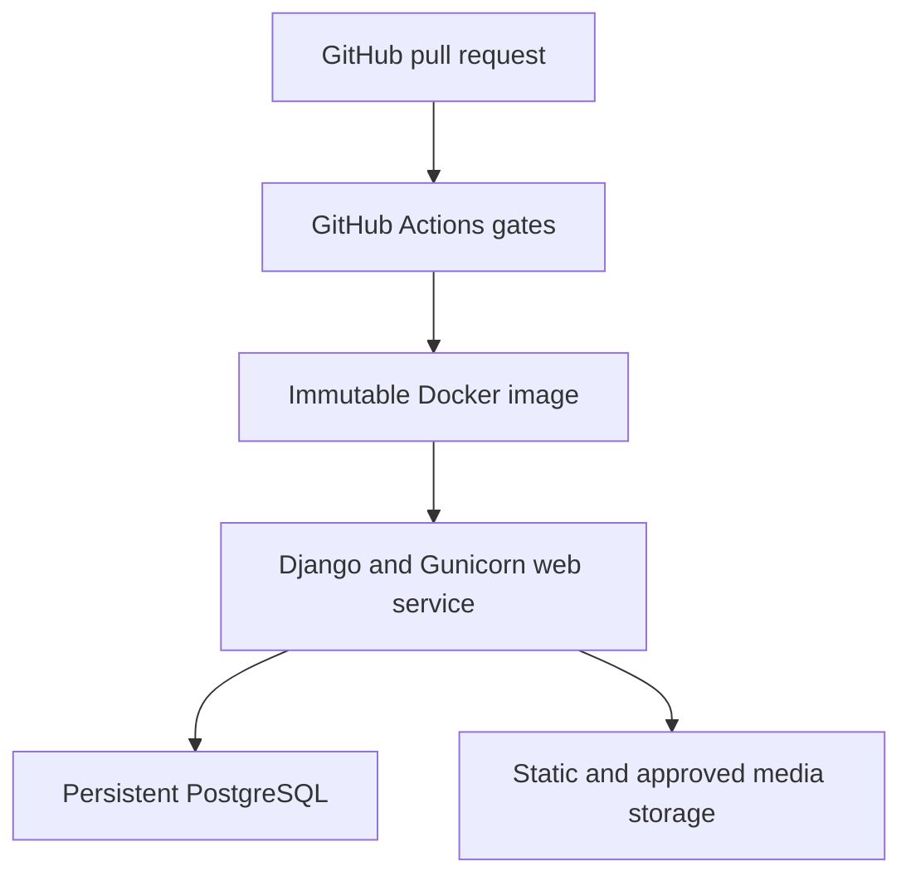

# Deployment and Release Guide

## Midlands State University Qualification Verification System

| Document item | Value |
|---|---|
| Module | MIM736 – Software Engineering |
| Assignment | DevOps-Enabled Qualification Verification System Using Git and CI/CD Practices |
| System | MSU Qualification Verification System (MSU QVS) |
| Document version | 0.2 – Updated team-review draft |
| Baseline date | 10 September 2026 |
| Repository | `unclechipaz/qualification_verification_system` |
| Baseline inspected | `develop` at `77df668f0cb5a0e81118a63ce1439f36ca42cf8c` |
| Document owner | Charlton – Project Lead and DevOps Architect |
| Supporting reviewers | Simba – Database Lead; Cleopatra – QA Lead |
| Approval status | Pending technical remediation, deployment test and team approval |

## Document control

| Version | Date | Change | Prepared by | Approval |
|---|---|---|---|---|
| 0.1 | 9 September 2026 | Initial deployment architecture, procedures, controls and evidence templates | Project team | Pending |
| 0.2 | 10 September 2026 | Updated implementation baseline, evidence and remaining work; retained requirement identifiers | Artwell (`artwel-dev`), with Codex assistance | Pending team review |

## Review baseline and interpretation

Reviewed on **10 September 2026** against `develop` at `77df668f0cb5a0e81118a63ce1439f36ca42cf8c` and the documentation in [PR #8](https://github.com/unclechipaz/qualification_verification_system/pull/8), head `ebc9594e49e17c40678f49c1d9e109753955e62b`. The application code is the same at these two revisions; PR #8 contains documentation changes and was **open, not merged**, when checked.

[PR #4](https://github.com/unclechipaz/qualification_verification_system/pull/4) repaired CI. [PR #6](https://github.com/unclechipaz/qualification_verification_system/pull/6) restricted public registration, applied password validation and checked login redirect destinations; it addresses [issue #5](https://github.com/unclechipaz/qualification_verification_system/issues/5). Both fixes are merged into `develop`. The [develop CI run](https://github.com/unclechipaz/qualification_verification_system/actions/runs/34408020848) and [PR #8 CI run](https://github.com/unclechipaz/qualification_verification_system/actions/runs/34471626306) completed successfully, including Django checks, migration-drift checking, pytest and Docker image building. These runs do not establish coverage, static analysis, PostgreSQL integration, deployment or complete security acceptance.

**Target versus current behaviour:** requirements, proposed controls and unchecked acceptance lists below describe work to deliver or approve. They are not claims of implementation or team sign-off. The assignment requires the four core capabilities, Git collaboration, CI/CD and quality evidence; detailed schema, role, hosting and numerical thresholds in this draft are proposed project decisions unless explicitly attributed to the brief. No additional assessment marks or lecturer requirements are inferred.

These findings apply to the inspected revisions. They do not establish the state of `main`, a live deployment or later commits. Refresh the evidence before release.

## 1. Purpose

This guide defines how the MSU QVS shall be packaged, configured, deployed, verified, backed up and rolled back. It covers:

- private local execution with Docker Compose;
- the target staging and demonstration deployment using Django, Gunicorn and persistent PostgreSQL;
- environment variables and secret handling;
- controlled database migrations and fictional demonstration data;
- static and media asset delivery;
- CI/CD promotion from pull request to release;
- deployment smoke tests, monitoring and recovery; and
- evidence required for assessment.

This is a deployment control document, not proof that a compliant deployment already exists. A deployment is accepted only after the release-specific evidence in this guide is completed.

## 2. Scope and related requirements

This guide primarily verifies:

- **DR-09 to DR-11:** timezone consistency, persistent storage and fictional demonstration data;
- **NFR-SEC-02 to NFR-SEC-04 and NFR-SEC-09:** HTTPS, protected secrets, restricted hosts/origins and deployment checks;
- **NFR-REL-02 and NFR-REL-03:** persistence, backup and restore;
- **NFR-MNT-03, NFR-MNT-04 and NFR-MNT-06:** configuration, migrations and reproducible containers;
- **NFR-DEV-05, NFR-DEV-07 and NFR-DEV-09:** quality gates, approved releases and controlled delivery; and
- **NFR-OPS-01 to NFR-OPS-06:** assessor access, persistent database, configuration, rollback, assets and health verification.

The requirements specification and traceability matrix remain authoritative if a conflict is found.

## 3. Deployment status at the inspected baseline

### 3.1 Honest readiness statement

The inspected baseline is suitable for private development and remediation. It shall **not** yet be described as secure, persistent or production-ready.

| Area | Repository evidence | Assessment | Required decision/action |
|---|---|---|---|
| Django runtime | Django and Gunicorn dependencies and a WSGI entry point exist; the current dependency range is Django>=5.0,<5.2. | Partial; dependency upgrade needed | Select/test a supported Django release (SEC-RISK-020); configure and prove Gunicorn startup. |
| Docker image | Python 3.13 image builds successfully in the linked baseline CI. | Build verified; release runtime pending | Add and test a production command, static delivery, health check and safer entrypoint. |
| Docker Compose | Django and PostgreSQL 16 services plus named database volume exist. | Development only | Remove hard-coded credentials, add database health check and keep `runserver` local only. |
| Database | Settings support individual PostgreSQL `DB_*` variables. | Partial | Use persistent PostgreSQL in every shared environment and add TLS configuration where required. |
| Vercel | `index.py`, `vercel.json` and temporary SQLite-copy logic exist. | Blocked for compliant release | Do not use temporary `/tmp` SQLite as the system of record. Use an external persistent database or choose the recommended container deployment. |
| Settings | Source contains a fallback secret, wildcard hosts, allow-all CORS and environment-dependent debug logic. | Blocked | Harden settings and pass `check --deploy`. |
| Static files | `STATIC_ROOT` exists, but the current build does not run `collectstatic` and deployed CSS previously returned 404. | Blocked | Select and implement a production static-file strategy. |
| Media | Local `MEDIA_ROOT` is used outside Vercel; Vercel uses `/tmp/media`. | Partial | Use durable object storage/volume for required generated media, or keep QR output self-contained and prove no durable media is required. |
| Migrations | Migrations are committed, but the entrypoint runs `makemigrations` at container startup. | Blocked | Generate and review migrations during development; deployed startup may apply committed migrations only through a controlled release step. |
| Seed data | `seed_db` migrates, writes known passwords and includes real-looking/team-related personal data. | Blocked for public use | Replace it with clearly fictional, idempotent demo data and never seed automatically on application restart. |
| Health check | No dedicated health endpoint or container health check exists. | Missing | Add a non-sensitive liveness/readiness endpoint and test it. |
| CI/CD | CI now passes system checks, drift check, pytest and Docker build; it has no deployment stage. | Partial | Retain PR #4 repair; add coverage, static/security analysis, real PostgreSQL integration and controlled delivery. |
| Release identity | Commit message says “Release v1.0.0”, but no Git tag existed at inspection. | Not a release record | Tag only a fully tested and approved commit. |

### 3.2 Relationship to the existing documentation PR

[PR #8](https://github.com/unclechipaz/qualification_verification_system/pull/8) corrects the old installation guide's clone URL, setting names and unsupported behaviour claims. Its head at review is `ebc9594e49e17c40678f49c1d9e109753955e62b` and it is still open. These six new documents are aligned with those corrected guides and the merged application code.

The current names are `DJANGO_SECRET_KEY` and individual `DB_*` variables; `SECRET_KEY` and `DATABASE_URL` are not parsed from the environment. `makemigrations` and the current seed are development tools, not an approved release-startup process. Keep PR #8's corrections when uploading this guide and add the new files to the documentation index. Editing documentation does not implement the proposed configuration changes below.

## 4. Proposed target architecture

### 4.1 Proposed deployment choice

A **container-based Django web service connected to managed persistent PostgreSQL** is the proposed project route. Render is an example, not an assignment-mandated provider or an existing repository integration. Confirm platform choice, access, region, cost and service lifetime before provisioning. The assignment permits accessible Docker or cloud deployment; equivalent approved platforms may be used. [Render Docker guidance](https://render.com/docs/docker) and [PostgreSQL connection guidance](https://render.com/docs/postgresql-creating-connecting) describe the example platform capabilities.



### 4.2 Architecture rules

1. The deployed web process shall use Gunicorn, not Django `runserver`.
2. The database shall be persistent PostgreSQL and shall survive application restart/redeployment.
3. The database and web service should be located in the same region and use private connectivity where the platform provides it.
4. HTTPS shall terminate at the platform/reverse proxy, and Django shall correctly recognise secure forwarded requests.
5. Static files shall be collected during build and served by an approved static strategy.
6. Required media shall use durable storage; an ephemeral container filesystem shall not be treated as permanent storage.
7. Migrations shall run as a controlled release task, once per release—not independently in every web worker.
8. Application images and evidence shall identify the exact tested commit SHA.
9. Staging and demonstration environments shall use only clearly fictional data.
10. Production access, secrets and deployment approval shall be limited to authorised team members.

## 5. Roles and separation of duties

| Role/member | Deployment responsibility |
|---|---|
| Charlton – Project Lead and DevOps Architect | Own environment design, CI/CD, hosting configuration, secret setup, release execution and rollback coordination. |
| Simba – Database and Registry Lead | Review migrations, approve database change order, validate constraints, backup and restore results. |
| Mncedisi (Artwell) – Search and Retrieval Specialist | Run deployed search, privacy and performance smoke tests using fictional data. |
| Doreen – Verification and Frontend UI Specialist | Verify public workflow, QR destination, PDF, responsive UI and deployed assets. |
| Cleopatra – Audit Trail and QA Lead | Confirm quality gates, RTM mapping, evidence completeness, audit behaviour and release recommendation. |
| Independent pull-request reviewer | Review deployment/configuration changes; author cannot be the only approver. |

Charlton may operate the deployment, but production approval requires both the Project Lead and QA Lead, with Database Lead approval for schema-changing releases.

## 6. Release and environment model

| Environment | Source | Purpose | Database | Deployment rule |
|---|---|---|---|---|
| Local development | Member feature branch | Implementation and focused tests | Local SQLite or PostgreSQL | Never publicly exposed |
| CI unit | Pull-request commit | Unit/API tests and static analysis | Temporary test database | Destroyed after job |
| CI PostgreSQL | Pull-request commit | Real migrations and integration tests | Temporary PostgreSQL 16 | Real committed migrations required |
| Staging | Approved `develop` commit | End-to-end, UAT, security and rollback tests | Persistent non-production PostgreSQL | Deploy only after green gates |
| Demonstration/release | Approved tagged `main` commit | Assessor-accessible system | Persistent PostgreSQL | Manual approval and completed release record |

Feature branches shall not deploy directly to the public demonstration environment. Preview environments, if used, must contain fictional data and isolated credentials.

## 7. Mandatory remediation before the first compliant cloud deployment

The following work shall be completed through genuine issues, feature branches and reviewed pull requests:

1. **Production settings:** remove the insecure `DJANGO_SECRET_KEY` fallback; make `DEBUG=False` effective outside Vercel; read exact allowed hosts and trusted origins from environment configuration.
2. **Host/origin restrictions:** remove `'*'` from `ALLOWED_HOSTS`, replace `CORS_ALLOW_ALL_ORIGINS=True`, and configure `CSRF_TRUSTED_ORIGINS` for the approved HTTPS origin.
3. **HTTPS controls:** configure secure session/CSRF cookies, proxy SSL header, HTTPS redirect and approved HSTS values for the deployed environment.
4. **Persistent database:** connect the shared deployment to PostgreSQL. Remove the Vercel temporary SQLite copy from the approved release path.
5. **Database TLS:** add a reviewed setting such as `DB_SSLMODE` if required by the chosen managed database.
6. **Entry point:** remove startup `makemigrations` and automatic `seed_db`; run migrations once as a controlled pre-deploy task.
7. **Safe seed:** replace the current seed with clearly fictional values and no public default passwords. Make demonstration seeding an explicit, one-time command.
8. **Static delivery:** run `collectstatic` during image build and add either WhiteNoise or a platform/reverse-proxy static service.
9. **Media decision:** configure durable media storage or prove that the release generates no required persistent media files.
10. **Public URL:** replace the hard-coded Vercel QR destination with an approved `PUBLIC_BASE_URL` setting.
11. **Health endpoint:** add `/health/` (or an equivalent path) that proves application readiness and database connectivity without disclosing configuration or records.
12. **Image hygiene:** add `.dockerignore` entries for `.git`, virtual environments, caches, `.env*`, coverage output, local SQLite databases and unneeded evidence files.
13. **Repository hygiene:** stop tracking `backend/db.sqlite3` as a deployment artifact; preserve any necessary demonstration data using safe fixtures instead.
14. **CI/CD:** make lint, tests, coverage, migration, security and image-build checks pass before delivery can run.
15. **Supported dependencies:** the current Django constraint excludes supported releases. Plan a reviewed upgrade and rerun migrations, tests, image build and security checks; changing this guide does not perform that upgrade. See SEC-RISK-020.
16. **Application blockers:** close the Critical/High access-control, public-data disclosure, PDF object-access and audit-data issues identified in the SRS/RTM before public release.

Until these items pass review, cloud deployment may be used only as an explicitly labelled prototype in a restricted test environment.

## 8. Configuration contract

### 8.1 Current variables recognised by settings

| Variable | Purpose | Local value pattern | Staging/release rule | Secret? |
|---|---|---|---|---|
| `DJANGO_SECRET_KEY` | Django signing key | Unique local value | Required, strong, platform-protected and different per environment; no source fallback | Yes |
| `DEBUG` | Debug behaviour | `True` for private development | Exactly `False`; current non-Vercel parsing must first be corrected | No |
| `DB_ENGINE` | Database backend | `django.db.backends.postgresql` for Compose | Must be `django.db.backends.postgresql` | No |
| `DB_NAME` | PostgreSQL database name, or SQLite file path in SQLite mode | `msu_qvs_db` for PostgreSQL; isolated absolute file path for SQLite | Platform-issued/approved value | Usually no |
| `DB_USER` | Database account | Local Compose account | Least-privilege application account | Yes |
| `DB_PASSWORD` | Database password | Private local value | Platform-protected, unique and rotated when exposed | Yes |
| `DB_HOST` | Database host | `db` inside Compose | Private managed-database host where possible | Sensitive |
| `DB_PORT` | Database port | `5432` | Platform value, normally `5432` | No |
| `VERCEL` | Vercel runtime marker | Unset | Platform-managed only; not a substitute for an environment mode | No |

`python-dotenv` is installed but the settings do not call it; a `.env` file alone does not load application configuration. Export variables in the shell or configure them through the container/platform. Setting `DEBUG=False` outside the Vercel mode does not disable debug in the current code. A present `VERCEL` variable also activates the SQLite-copy branch; do not set it locally as a workaround.

`DATABASE_URL` and `SECRET_KEY` are **not** read by the inspected settings. Do not rely on them unless a reviewed code change adds and tests that contract.

### 8.2 Target variables to implement

| Variable | Purpose | Example form—not a real value | Release rule |
|---|---|---|---|
| `DJANGO_ENV` | Explicit environment mode | `production` | Controls hardened settings predictably |
| `ALLOWED_HOSTS` | Comma-separated hostnames | `qvs-example.onrender.com` | Exact hosts only; no scheme and no wildcard |
| `CSRF_TRUSTED_ORIGINS` | Approved browser origins | `https://qvs-example.onrender.com` | HTTPS origins only |
| `CORS_ALLOWED_ORIGINS` | Approved cross-origin API clients | `https://approved-client.example` | Omit/empty if cross-origin API access is unnecessary |
| `PUBLIC_BASE_URL` | Canonical links and QR destination | `https://qvs-example.onrender.com` | One approved HTTPS origin, no trailing path |
| `DB_SSLMODE` | Proposed PostgreSQL TLS policy | Provider-approved mode | Add/test this setting first; require certificate/hostname verification where supported, with the provider CA configuration |
| `PORT` | Web-service listening port | Platform supplied | Gunicorn must bind to `0.0.0.0:$PORT` |
| `RELEASE_SHA` | Deployed source identity | Full Git commit SHA | Set by CI/deployment; expose only through safe health/version metadata |

If different variable names are implemented, update this guide, the installation guide, CI workflow and hosting configuration in the same pull request.

### 8.3 Secret rules

- Store cloud secrets in the hosting platform and GitHub environment secrets, never in Git, screenshots, issues, reports or chat.
- Do not commit `.env`, `.env.local`, database dumps, access tokens or private keys.
- Do not use the current Compose/PostgreSQL passwords outside private local development.
- Treat every credential already published in source or a public environment as compromised and rotate it.
- Give the web application only the database privileges it needs; use separate administrative credentials for backup/restore tasks.
- Mask secrets in CI logs and disable shell tracing around secret-bearing commands.
- Keep staging and release credentials separate.

## 9. Private local Docker Compose procedure

### 9.1 Prerequisites

- Git;
- Docker Engine or Docker Desktop with Compose v2;
- free local ports 8000 and 5432; and
- a private checkout of the approved branch.

The checked-in Compose ports bind on all host interfaces. Use a private machine/firewall, or first change the mappings to `127.0.0.1:8000:8000` and `127.0.0.1:5432:5432` in a reviewed local configuration. The source bind mount lets startup `makemigrations` write files into the checkout; inspect `git diff` afterwards.

### 9.2 Start the current development stack

From the repository root:

```bash
docker compose -f docker/docker-compose.yml up --build
```

When startup succeeds, the current stack exposes PostgreSQL on port 5432 and Django at `http://localhost:8000/`. The entrypoint generates migrations, applies them and runs the seed before starting `runserver`. Image building succeeded in CI; Compose startup and persistence were not exercised in this documentation review.

> **Local-only warning:** the current Compose file uses known database credentials, enables debug mode, uses Django `runserver`, automatically seeds known application passwords and mounts the source tree. Do not expose this stack to the internet or use it as production evidence.

### 9.3 Inspect the stack

```bash
docker compose -f docker/docker-compose.yml ps
docker compose -f docker/docker-compose.yml logs --tail=100 web
docker compose -f docker/docker-compose.yml logs --tail=100 db
```

Check:

- the `db` and `web` services remain running;
- migrations finish without generating uncommitted files;
- `/`, `/verify/`, `/auth/login/` and required assets load; and
- a record remains available after restarting only the web service.

### 9.4 Stop without deleting database data

```bash
docker compose -f docker/docker-compose.yml down
```

The named `postgres_data` volume is intended to remain. Removing that volume deletes the local PostgreSQL data and is not part of the normal stop procedure.

## 10. Production container contract

After the mandatory remediation, the container shall meet this contract:

| Concern | Required behaviour |
|---|---|
| Base | Supported Python 3.13 slim image with patched dependencies |
| Build context | Repository root, using `docker/Dockerfile` |
| Dependency installation | Deterministic and fails on installation error |
| Static files | `collectstatic --noinput` succeeds during build |
| Runtime user | Non-root application user where platform permits |
| Startup | Gunicorn WSGI process; no `runserver` |
| Startup mutation | No `makemigrations`, automatic seed or destructive database action |
| Port | Bind `0.0.0.0` to the platform-provided port |
| Health | Platform health check calls safe `/health/` endpoint |
| Shutdown | Gunicorn receives and handles termination signal cleanly |
| Identity | Image/deployment records exact Git SHA and immutable image digest |

The target web command is:

```bash
sh -c 'exec gunicorn --chdir backend msu_qvs.wsgi:application --bind 0.0.0.0:${PORT:-8000} --workers 2 --timeout 120'
```

Worker count and timeout shall be load-tested against the selected hosting plan. They are starting values, not measured performance results.

Build an immutable local candidate from a clean release checkout with:

```bash
git rev-parse --verify HEAD
docker build --pull --file docker/Dockerfile --tag msu-qvs:candidate .
```

The existing image build succeeded in the [develop CI run](https://github.com/unclechipaz/qualification_verification_system/actions/runs/34408020848) and [PR #8 CI run](https://github.com/unclechipaz/qualification_verification_system/actions/runs/34471626306). These workflows do not start the image, run PostgreSQL integration or prove a deployment. The production command above is a target configuration, not a command already set by the Dockerfile; the current image has an entrypoint but no default CMD.

## 11. Example Render deployment procedure (proposed)

Platform interfaces change over time; verify the current official Render documentation before executing these steps. The repository-specific controls below remain mandatory.

### 11.1 Create the persistent PostgreSQL service

1. Create a managed PostgreSQL service in the chosen account/region.
2. Place the database in the same region as the web service.
3. Select a retention/availability plan that remains active for the full assessment period and supports the required backup evidence.
4. Restrict external database access; prefer the platform's private/internal connection details.
5. Record the PostgreSQL major version, database identifier and backup policy without copying credentials into the repository.
6. Map the platform connection fields to `DB_NAME`, `DB_USER`, `DB_PASSWORD`, `DB_HOST` and `DB_PORT`.

### 11.2 Create the Docker web service

1. Connect the approved GitHub repository.
2. Select the protected release branch only after CI is green.
3. Select Docker deployment and set the Dockerfile path to `docker/Dockerfile` with repository root as build context.
4. Configure the target Gunicorn command.
5. Add the reviewed environment variables from Section 8.
6. Configure the health-check path only after `/health/` is implemented.
7. Keep production auto-deploy disabled until the chosen deployment path actually enforces review and passing checks. A GitHub environment approval protects only jobs referencing that environment; it does not automatically gate a separate hosting-platform auto-deploy integration.
8. Use the platform's generated HTTPS hostname initially; add a custom domain only if authorised.

### 11.3 Configure build and release tasks

The corrected build shall run static collection:

```bash
python backend/manage.py collectstatic --noinput
```

The controlled pre-deploy/release task shall apply committed migrations once:

```bash
python backend/manage.py migrate --noinput
```

Never place `makemigrations` or the current `seed_db` command in the production build, entrypoint or every-instance startup.

### 11.4 First deployment

1. Deploy to staging from an approved `develop` commit.
2. Confirm the release SHA and image digest.
3. Run migration, deployment-check and smoke-test evidence.
4. Load only approved fictional demonstration data through the replacement safe seed command.
5. Complete UAT and the persistence/rollback exercises.
6. Merge the accepted release to `main` through an independently reviewed pull request.
7. Create an annotated release tag only after QA approval.
8. Deploy the exact tested tag/SHA to the demonstration environment.
9. Run the post-deployment checklist and store the deployment record.

## 12. Vercel deployment status

The current Vercel configuration is a prototype path, not the approved release path.

| Current behaviour | Risk | Requirement before reconsideration |
|---|---|---|
| SQLite copied to `/tmp/db.sqlite3` | Writes may disappear across serverless instances/redeployments. | Connect to persistent PostgreSQL and prove restart/redeployment persistence. |
| Media root uses `/tmp/media` | Generated files are not durable. | Use approved object storage or remove the need for persistent files. |
| Static route points to `/static/` | It does not itself prove `collectstatic` output is built and served. | Implement and test an explicit static build/delivery strategy. |
| `index.py` loads WSGI; the Docker entrypoint is not a Vercel release job | Current Vercel configuration provides no demonstrated controlled migration step. | Define and test one release job for committed migrations; do not assume container startup runs on Vercel. |
| QR code points to a hard-coded Vercel hostname | Preview/custom domains can generate wrong links. | Use tested `PUBLIC_BASE_URL`. |

Vercel can use external storage services, including relational database integrations, but merely deploying the current `vercel.json` does not meet DR-10, NFR-REL-02 or NFR-OPS-02.

## 13. Database migration procedure

### 13.1 Before merge

The feature author and Database Lead shall:

```bash
python backend/manage.py makemigrations --check --dry-run
python backend/manage.py showmigrations
python backend/manage.py migrate --plan
```

- Commit every required migration with the model change.
- Review data migrations for reversibility, runtime and privacy.
- Test migrations from an empty PostgreSQL 16 database and from a representative staging backup.
- Do not edit an already-applied migration merely to hide a change.

### 13.2 Before release

1. Confirm a restorable backup/restore point.
2. Record current release SHA and current migration list.
3. Review `migrate --plan` against the intended change.
4. Pause deployment if an unexpected destructive operation appears.
5. Apply committed migrations once with `migrate --noinput`.
6. Record command result and updated migration list.
7. Run database and application smoke tests.

### 13.3 Seed and administrator accounts

The current `python backend/manage.py seed_db` command shall **not** run in staging or the public demonstration environment because it:

- contains real-looking/team-related names, email addresses, National IDs and organisation details;
- sets known passwords each time it runs;
- invokes migrations internally; and
- creates additional verification history on repeat execution.

Replace it with a reviewed, idempotent command that uses values such as `Test Graduate Alpha`, `registrar@example.test`, `TEST-NID-0001` and random platform-protected passwords.

Create the initial privileged account once from an authorised platform shell. Django superuser privileges and the application `role` are separate: `createsuperuser` grants Django privileges, but the model default role remains `PUBLIC_VERIFIER`. After creation, set the application role to `ADMINISTRATOR` through an authorised admin workflow and verify both access paths:

```bash
python backend/manage.py createsuperuser
```

Do not place that password in a script, README, screenshot or demonstration video.

## 14. Static and media assets

### 14.1 Static files

The repository uses:

- `STATIC_URL = '/static/'`;
- `STATIC_ROOT = backend/staticfiles`; and
- source assets under `backend/static/`.

Django's development helper serves these only in debug mode and is not a production strategy. The team shall choose one of:

1. **WhiteNoise in the application image:** add and configure the dependency and hashed static storage, then run `collectstatic`; or
2. **Platform/reverse-proxy static service:** publish the collected `STATIC_ROOT` directory separately.

The release smoke test shall request at least:

- `/static/css/style.css`;
- `/static/js/main.js`; and
- `/static/img/msu_logo.svg`.

Every response shall be successful, use the expected content type and render correctly on the deployed pages.

### 14.2 Media and QR codes

The `Certificate` model includes an optional `qr_code_image`, while `qr_code_base64` can generate a self-contained QR image. The team shall make one explicit release decision:

- if self-contained QR output is sufficient, do not claim durable uploaded-media support; or
- if stored QR/media files are required, configure durable object storage or a persistent volume and test access after redeployment.

Never depend on `/tmp/media` or a normal ephemeral web-container directory for permanent records.

## 15. CI/CD delivery design

### 15.1 Required pipeline stages

| Stage | Trigger | Required result | Evidence |
|---|---|---|---|
| Source checks | Pull request | Formatting/lint and Django system checks pass | GitHub Actions job |
| Unit/API tests | Pull request | All selected tests pass | Pytest result |
| PostgreSQL integration | Pull request | Clean migration and integration tests pass | Service/job log |
| Coverage | Pull request | Approved threshold met | Summary and artifact |
| Security/dependencies | Pull request | No unaccepted blocking finding | Scan result |
| Docker build | Pull request | Immutable image builds | Job and image digest |
| Staging delivery | Approved `develop` commit | Deploy, migrate and smoke tests pass | Protected environment record |
| UAT/release approval | Release candidate | QA and project approvals recorded | Test Summary Report |
| Demonstration delivery | Approved tag on `main` | Exact approved SHA deployed | Deployment record |
| Post-deploy verification | Every delivery | Health, database, static and core workflow checks pass | Smoke-test artifact |

### 15.2 Branch and approval rules

- Require pull requests for `develop` and `main`.
- Require successful quality gates before merge.
- Require a reviewer other than the author.
- Limit production secrets to a protected GitHub environment.
- Require manual approval before the demonstration deployment job.
- Deploy by immutable tag/SHA, not an ambiguous moving `latest` image alone.
- Record a genuine contribution trail; generated empty commits are not release evidence.

## 16. Controlled release procedure

### 16.1 Pre-deployment checklist

- [ ] Release issue identifies scope, owner, window and rollback target.
- [ ] Release candidate commit is on an approved branch and all required PRs are reviewed.
- [ ] Tests, coverage, static analysis, security checks and Docker build are green.
- [ ] `makemigrations --check --dry-run` reports no missing migration.
- [ ] Clean PostgreSQL migration/integration job passes.
- [ ] Critical and High defects are closed.
- [ ] Settings, hosts, origins, CORS, HTTPS and secrets are approved.
- [ ] Demonstration data is fictional and reviewed.
- [ ] Backup/restore point exists and has an identifier.
- [ ] Rollback commit/image and schema-compatibility decision are recorded.
- [ ] User, administrator, API, architecture, test and deployment documents match the candidate.

### 16.2 Deployment sequence

1. Freeze the release candidate and record its full SHA.
2. Create/verify the database backup or managed restore point.
3. Build or select the immutable image produced from that SHA.
4. Review and run committed migrations once.
5. Deploy the application image with protected environment configuration.
6. Wait for health/readiness success.
7. Run automated post-deployment smoke tests.
8. Perform the minimum manual UI/QR/PDF checks.
9. Confirm one fictional record persists across a web-service restart/redeployment.
10. Record logs, URLs, image digest, test results and approvers.
11. If any release criterion fails, invoke Section 19 rather than hiding or rerunning away the failure.

### 16.3 Release tag

After acceptance, create an annotated tag using the team's approved version:

```bash
git tag -a v1.0.0 -m "MSU QVS assessed release v1.0.0"
git show --no-patch --format=fuller v1.0.0
```

Use an unused, agreed version; do not overwrite an existing tag. The authorised release operator shall push it only after confirming it resolves to the tested release SHA. A merge into `main` can create a new SHA; rerun required release checks on that resulting commit before tagging/deployment. A release-like commit message without a Git tag is not equivalent evidence.

## 17. Deployment verification

### 17.1 Pre-deploy commands

Run from the repository root in CI using the corrected production settings mode and isolated test credentials. These are pre-deployment target checks; the current settings do not yet satisfy deployment hardening. `check --deploy` can print warnings without a non-zero exit code by default, so an enforcing gate should use `--fail-level WARNING`:

```bash
python backend/manage.py check
python backend/manage.py check --deploy --fail-level WARNING
python backend/manage.py makemigrations --check --dry-run
python backend/manage.py migrate --plan
python -m pytest --tb=short
```

Coverage, lint and security commands shall follow `docs/TESTING_AND_VERIFICATION.md` after their dependencies/configurations are committed.

### 17.2 Post-deploy automated smoke checks

Set the approved host and fictional smoke-test certificate through protected CI variables:

```bash
QVS_BASE_URL="https://replace-with-approved-host.example"
QVS_SMOKE_CERTIFICATE="TEST-CERT-ACTIVE-0001"
curl --fail --show-error --silent "$QVS_BASE_URL/" > /dev/null
curl --fail --show-error --silent "$QVS_BASE_URL/static/css/style.css" > /dev/null
curl --fail --show-error --silent "$QVS_BASE_URL/health/"
curl --fail --show-error --silent \
  --request POST \
  --header "Content-Type: application/json" \
  --data "{\"query\":\"$QVS_SMOKE_CERTIFICATE\"}" \
  "$QVS_BASE_URL/api/verify/"
```

The `/health/` call is a target check and will fail until the endpoint is implemented. The verification response shall be checked for the approved minimised schema; the current API response exposes fields that the RTM requires the team to remove or restrict.

### 17.3 Minimum manual smoke test

| Check | Expected result | Related test |
|---|---|---|
| HTTPS and home page | Valid HTTPS page; no debug traceback | TC-NFR-001, TC-NFR-005 |
| Health/readiness | Application and database reported available without sensitive detail | TC-NFR-013 |
| Static assets | CSS, JavaScript and MSU logo load | TC-NFR-016 |
| Exact fictional active certificate | Correct VERIFIED result with minimised data | TC-VER-001 |
| Fictional revoked certificate | Correct REVOKED result, never shown valid | TC-VER-002 |
| Invalid identifier | Privacy-safe INVALID/NOT FOUND result | TC-VER-004, TC-SRCH-021 |
| QR scan | QR opens current approved HTTPS host and normal verification path | TC-VER-005 |
| PDF | Authorised statement is readable and access-controlled | TC-VER-009, TC-VER-010 |
| Employer history | Employer sees only own history/export | TC-AUD-007, TC-AUD-008 |
| Persistence | Created fictional record remains after restart/redeploy | TC-DB-009, TC-NFR-023 |

## 18. Backup and restore verification

### 18.1 Backup policy

- Prefer the managed PostgreSQL service's protected backup/restore features.
- Record frequency, retention, encryption, restore permissions and expiry for the selected plan.
- Complete at least one restore test before release; an untested backup is not sufficient evidence.
- Store manual dumps outside the Git working tree in access-controlled storage.
- Treat dumps as restricted because they may contain personal and audit data.

### 18.2 Manual logical backup example

Run from an authorised environment with PostgreSQL client tools and protected variables:

```bash
set -eu
umask 077
qvs_backup_dir="/absolute/private/path/outside-the-repository"
test -d "$qvs_backup_dir" || { printf 'Choose an existing private backup directory.\n'; exit 1; }
qvs_backup_file="$qvs_backup_dir/msu_qvs_$(date -u +%Y%m%dT%H%M%SZ).dump"
test ! -e "$qvs_backup_file" || { printf 'Refusing to overwrite %s\n' "$qvs_backup_file"; exit 1; }
PGPASSWORD="$DB_PASSWORD" pg_dump \
  --host="$DB_HOST" \
  --port="$DB_PORT" \
  --username="$DB_USER" \
  --format=custom \
  --file="$qvs_backup_file" \
  "$DB_NAME"
chmod 600 "$qvs_backup_file"
pg_restore --list "$qvs_backup_file" > /dev/null
```

Do not commit the dump. Record a protected checksum and backup identifier in the deployment record, not the database credentials or dump contents.

### 18.3 Restore test

1. Provision a new, empty and clearly labelled non-production restore database.
2. Confirm the target identity before writing.
3. Restore the archive without overwriting staging or production.
4. Point an isolated application instance to the restored database.
5. Apply no unplanned migrations.
6. Compare migration state, row counts and selected fictional records.
7. Run read-only verification and audit-history checks.
8. Record duration, result, tester, reviewer and cleanup owner.

A restore that cannot be completed within the assessment window shall be treated as a release blocker until an approved recovery plan exists.

## 19. Rollback and failed-deployment procedure

### 19.1 Rollback triggers

Rollback or halt rollout when any of the following occurs:

- health/readiness fails repeatedly;
- migrations fail or leave an uncertain state;
- authentication/authorisation is bypassed;
- private data is exposed;
- active/revoked status is incorrect;
- static/QR/PDF functionality required for the demonstration fails;
- error rate increases materially; or
- the persistence test fails.

### 19.2 Application rollback

1. Stop further promotion and notify the Project Lead and QA Lead.
2. Preserve relevant non-sensitive logs and the failed release identifiers.
3. Confirm the last known-good image digest/SHA and schema compatibility.
4. Take/confirm a database restore point when safe.
5. Redeploy the last known-good immutable image.
6. Run health, static, verification and persistence smoke tests.
7. Record the incident and open a corrective issue before another release attempt.

### 19.3 Database-aware rollback

Application rollback is safe only if the older code can operate with the current schema. For schema-changing releases:

- prefer backward-compatible migrations and a forward fix;
- test reverse migration in staging before relying on it;
- never guess a reverse target during an incident;
- if a migration is irreversible or data-changing, restore to a new database from the approved restore point and switch only after validation; and
- obtain Database Lead approval before any production schema reversal.

An example reverse command may be used only with an explicitly reviewed app and migration target:

```bash
qvs_app_label="replace_with_app_label"
qvs_previous_migration="replace_with_previous_migration"
python backend/manage.py migrate "$qvs_app_label" "$qvs_previous_migration" --plan
python backend/manage.py migrate "$qvs_app_label" "$qvs_previous_migration" --noinput
```

Run this first against an isolated restore. Never use `zero`, delete migration records manually or delete a database as an improvised rollback.

## 20. Security and privacy release controls

- Run `check --deploy` with the actual production settings mode.
- Confirm `DEBUG=False` by behaviour and configuration test.
- Use exact `ALLOWED_HOSTS`, `CSRF_TRUSTED_ORIGINS` and CORS allowlists.
- Confirm HTTPS redirect, secure cookies and proxy SSL handling.
- Rotate source-exposed/default secrets and remove insecure fallbacks.
- Retain PR #6 public-role restrictions and password/redirect regressions. Separately prevent Registrars from assigning privileged roles; that user-management defect is still open.
- Restrict public search and minimise verification output.
- Authorise PDF/history objects, not just their URLs.
- Mask National IDs and sensitive search values in responses, logs and exports.
- Add throttling to login, public verification and sensitive search.
- Ensure audit/application logs contain no passwords, tokens or full restricted identifiers.
- Disable public known demo credentials; demonstration logins shall be controlled and fictional.
- Review dependency and static-security scan findings before approval.

No public deployment shall be used to test with real student records.

## 21. Monitoring, logs and incident response

### 21.1 Minimum operational signals

| Signal | Purpose | Release expectation |
|---|---|---|
| Health/readiness status | Detect application/database outage | Platform check and CI smoke test |
| HTTP 5xx rate | Detect application failures | Alert/review threshold agreed by team |
| Response time | Detect performance regression | Compare with NFR-PERF targets |
| Database connections/storage | Prevent exhaustion | Platform metrics reviewed |
| Deployment events | Correlate failures with release | SHA, image digest and timestamp retained |
| Security/audit events | Investigate denied/suspicious activity | Privacy-safe, access-controlled records |

### 21.2 Logging rules

- Include timestamp, severity, request correlation identifier and release SHA where practical.
- Do not log passwords, tokens, secret keys, full National IDs or unrestricted request bodies.
- Treat IP addresses and user agents as controlled personal/security data.
- Restrict log access and define retention consistent with the approved policy.
- Preserve relevant evidence when investigating a release failure without publishing it in Git.

### 21.3 Incident record

Every deployment incident shall record detected time, release SHA, environment, effect, affected requirement, immediate containment, rollback/forward-fix decision, owner, evidence and closure review.

## 22. Troubleshooting guide

| Symptom | Likely cause | Safe diagnostic/correction |
|---|---|---|
| `DisallowedHost` | Deployed host absent from allowlist | Add exact hostname through approved environment configuration; do not restore wildcard hosts. |
| CSRF origin failure | HTTPS origin missing/malformed | Add exact scheme and host to trusted origins; confirm proxy HTTPS settings. |
| CSS/JavaScript/logo returns 404 | No `collectstatic` or static server | Inspect build output and chosen static delivery; do not enable debug as a fix. |
| `OperationalError` connecting to PostgreSQL | Wrong host/credentials/network/TLS | Compare protected `DB_*` settings, private-network access and required SSL mode. |
| `relation does not exist` | Committed migrations not applied | Inspect `showmigrations`/release logs; run approved migration task once. |
| Container starts but web service is unavailable | No production command or wrong port | Confirm Gunicorn module path, `--chdir backend` and platform port binding. |
| Data disappears after redeployment | SQLite or ephemeral database/media path | Stop release; move to persistent PostgreSQL/durable storage and restore approved data. |
| Seed duplicates or resets passwords | `seed_db` runs at startup | Remove automatic seed; replace with explicit safe idempotent command. |
| QR opens old Vercel hostname | URL hard-coded in `Certificate.qr_code_base64` | Implement `PUBLIC_BASE_URL`, regenerate test QR and verify destination. |
| Health path returns 404 | Endpoint not implemented | Keep deployment blocked until safe health/readiness endpoint and tests exist. |
| Docker build cannot find requirements/source | Incorrect Docker build context | Use repository root as context and `docker/Dockerfile` as Dockerfile path. |
| `check --deploy` reports warnings | Incomplete hardened settings | Correct or formally document each approved exception; do not suppress the command. |

## 23. Deployment evidence record template

Create one record per staging and demonstration release, for example `docs/evidence/DEPLOYMENT_v1.0.0.md`.

### 23.1 Identification

| Field | Recorded value |
|---|---|
| Deployment record ID | `TBD` |
| Environment | `TBD` |
| Public/staging URL | `TBD` |
| Deployment start/end | `TBD` |
| Release tag | `TBD` |
| Full commit SHA | `TBD` |
| Docker image digest | `TBD` |
| Workflow/deploy URL | `TBD` |
| Operator | `TBD` |
| Independent approver | `TBD` |

### 23.2 Configuration and database

| Field | Recorded value |
|---|---|
| Python/Django/PostgreSQL versions | `TBD` |
| Secret review completed | `TBD` |
| Allowed host/origin review | `TBD` |
| Pre-deploy migration state | `TBD` |
| Applied migrations | `TBD` |
| Backup/restore-point identifier | `TBD` |
| Rollback image/SHA | `TBD` |
| Demonstration dataset version | `TBD` |

### 23.3 Verification results

| Check | Result/evidence |
|---|---|
| CI required checks | `TBD` |
| Django deployment check | `TBD` |
| Health/database check | `TBD` |
| Static/media check | `TBD` |
| Core verification smoke test | `TBD` |
| Permission/privacy smoke test | `TBD` |
| Persistence after restart/redeploy | `TBD` |
| Backup restore test | `TBD` |
| Rollback exercise | `TBD` |
| UAT/Test Summary Report | `TBD` |

### 23.4 Decision

| Field | Recorded value |
|---|---|
| Known defects/accepted risks | `TBD` |
| Release decision | `Approved / Rejected / Rolled back` |
| Project Lead approval/date | `TBD` |
| QA Lead approval/date | `TBD` |
| Database Lead approval/date, if applicable | `TBD` |

Do not paste environment-variable values, database dumps, personal data or secret-bearing logs into the evidence record.

## 24. Final deployment acceptance checklist

- [ ] NFR-OPS-01: assessor-accessible HTTPS deployment is available for the agreed period.
- [ ] DR-10, NFR-REL-02 and NFR-OPS-02: persistent PostgreSQL survives restart/redeployment.
- [ ] NFR-OPS-03: implemented environment variables match this guide and no secret is published.
- [ ] NFR-OPS-04: safe rollback/redeployment has been demonstrated in non-production.
- [ ] NFR-OPS-05: required static, QR, PDF and media assets load.
- [ ] NFR-OPS-06: health/readiness confirms application and database availability.
- [ ] NFR-REL-03: backup was restored and verified in an isolated environment.
- [ ] NFR-MNT-04: only reviewed, committed migrations were applied.
- [ ] NFR-MNT-06: Docker build is reproducible in CI.
- [ ] NFR-SEC-02 to NFR-SEC-04 and NFR-SEC-09: HTTPS/settings/secrets/hosts/origins pass review and deployment checks.
- [ ] DR-11: all public demonstration data is clearly fictional.
- [ ] NFR-DEV-05 and NFR-DEV-09: quality gates and controlled delivery are green.
- [ ] NFR-DEV-07: approved release tag, tested SHA and deployed SHA are identical.
- [ ] Test Summary Report recommends release and required approvals are recorded.

## 25. Approval record

| Approver role | Member | Approval scope | Decision/date | Evidence |
|---|---|---|---|---|
| Project Lead and DevOps Architect | Charlton | Architecture, platform, CI/CD, deployment and rollback | Pending | — |
| Database and Registry Lead | Simba | PostgreSQL, migrations, backup and restore | Pending | — |
| Audit Trail and QA Lead | Cleopatra | Gates, smoke tests, evidence and release recommendation | Pending | — |
| Search and Retrieval Specialist | Mncedisi (Artwell) | Deployed search, privacy and performance verification | Pending | — |
| Verification and Frontend UI Specialist | Doreen | UI, QR, PDF, accessibility and asset verification | Pending | — |

## 26. References

### Repository documents and configuration

- `docs/REQUIREMENTS.md`.
- `docs/REQUIREMENTS_TRACEABILITY_MATRIX.md`.
- `docs/TESTING_AND_VERIFICATION.md`.
- `docs/DATABASE_ERD.md`.
- `docs/ARCHITECTURE.md`.
- `docs/INSTALLATION_GUIDE.md`.
- `backend/msu_qvs/settings.py` and `backend/msu_qvs/urls.py`.
- `docker/Dockerfile`, `docker/docker-compose.yml` and `docker/entrypoint.sh`.
- `.github/workflows/ci_cd.yml`.
- `vercel.json` and `index.py`.

### External primary references

- [Django deployment checklist](https://docs.djangoproject.com/en/5.1/howto/deployment/checklist/).
- [Django static-files deployment](https://docs.djangoproject.com/en/5.1/howto/static-files/deployment/).
- [Render: Deploy a Django application](https://render.com/docs/deploy-django).
- [Render: Docker deployments](https://render.com/docs/docker).
- [Render: Create and connect to PostgreSQL](https://render.com/docs/postgresql-creating-connecting).
- [Vercel storage overview](https://vercel.com/docs/storage).
- [PostgreSQL `pg_dump`](https://www.postgresql.org/docs/16/app-pgdump.html) and [`pg_restore`](https://www.postgresql.org/docs/16/app-pgrestore.html).
- [Docker Compose service definitions](https://docs.docker.com/reference/compose-file/services/).

References were retained from the 0.1 draft; Django deployment guidance, Django support status, Render Docker guidance and Render PostgreSQL guidance were checked on 10 September 2026. Other links remain background references. Reconfirm platform plans, access and interface labels before provisioning. Django 5.1 documentation describes the inspected code, not a supported release target.
