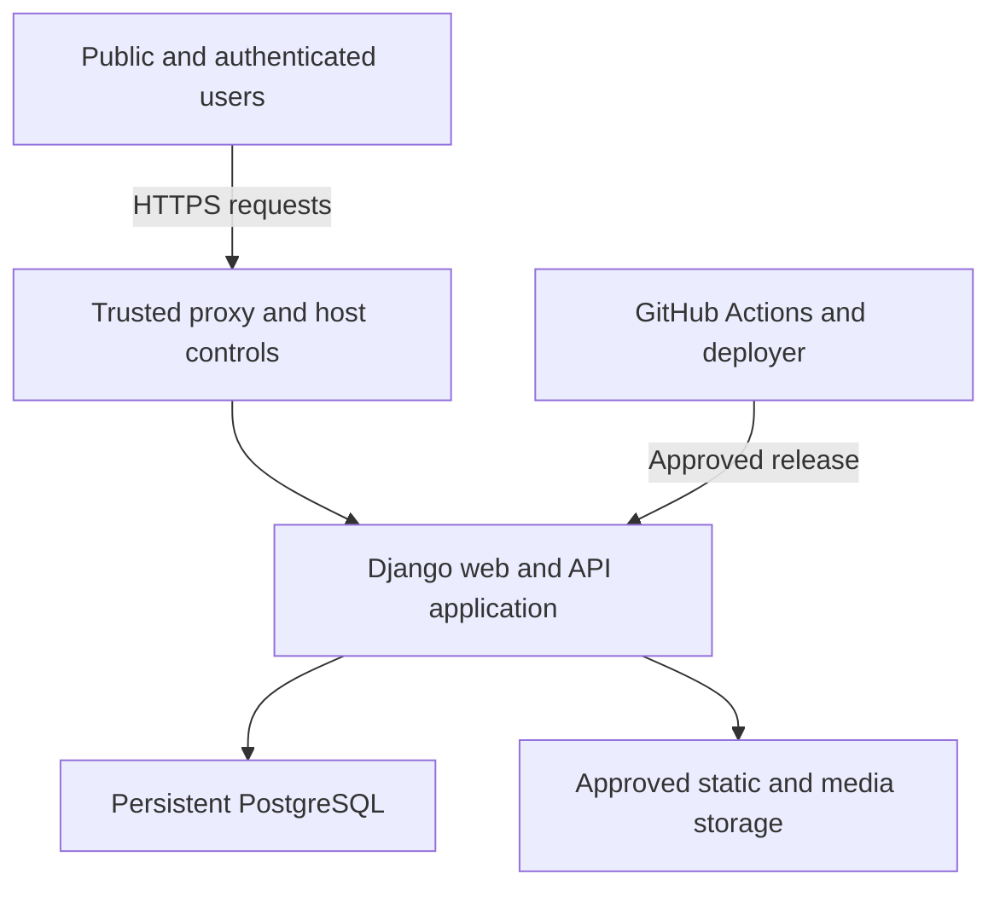
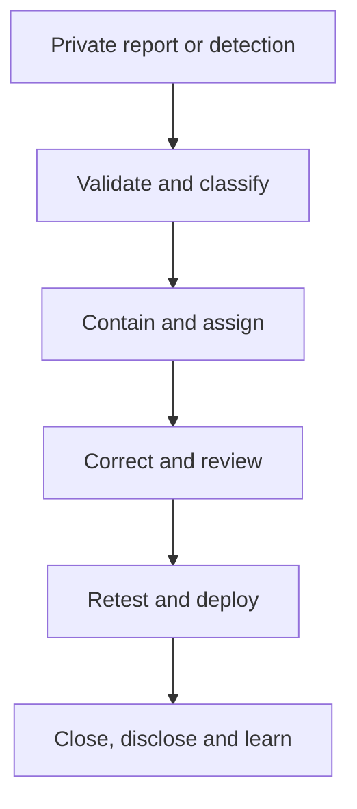

# Security and Privacy Policy

## Midlands State University Qualification Verification System

| Document item | Value |
|---|---|
| Module | MIM736 – Software Engineering |
| Assignment | DevOps-Enabled Qualification Verification System Using Git and CI/CD Practices |
| System | MSU Qualification Verification System (MSU QVS) |
| Policy version | 0.2 – Updated team-review draft |
| Baseline date | 10 September 2026 |
| Repository | `unclechipaz/qualification_verification_system` |
| Baseline inspected | `develop` at `77df668f0cb5a0e81118a63ce1439f36ca42cf8c` |
| Policy owner | Charlton – Project Lead and DevOps Architect |
| Security assurance owner | Cleopatra – Audit Trail and QA Lead |
| Approval status | Pending remediation, security testing and team approval |

## Document control

| Version | Date | Change | Prepared for | Approval |
|---|---|---|---|---|
| 0.1 | 9 September 2026 | Initial security policy and risk register | Project team | Pending |
| 0.2 | 10 September 2026 | Reconciled merged authentication fixes, CI evidence, remaining risks and proposed controls | Artwell (`artwel-dev`), with Codex assistance | Pending team review |

## Review baseline and interpretation

Reviewed on **10 September 2026** against `develop` at `77df668f0cb5a0e81118a63ce1439f36ca42cf8c` and the documentation in [PR #8](https://github.com/unclechipaz/qualification_verification_system/pull/8), head `ebc9594e49e17c40678f49c1d9e109753955e62b`. The application code is the same at these two revisions; PR #8 contains documentation changes and was **open, not merged**, when checked.

[PR #4](https://github.com/unclechipaz/qualification_verification_system/pull/4) repaired CI. [PR #6](https://github.com/unclechipaz/qualification_verification_system/pull/6) restricted public registration, applied password validation and checked login redirect destinations; it addresses [issue #5](https://github.com/unclechipaz/qualification_verification_system/issues/5). Both fixes are merged into `develop`. The [develop CI run](https://github.com/unclechipaz/qualification_verification_system/actions/runs/34408020848) and [PR #8 CI run](https://github.com/unclechipaz/qualification_verification_system/actions/runs/34471626306) completed successfully, including Django checks, migration-drift checking, pytest and Docker image building. These runs do not establish coverage, static analysis, PostgreSQL integration, deployment or complete security acceptance.

**Target versus current behaviour:** requirements, proposed controls and unchecked acceptance lists below describe work to deliver or approve. They are not claims of implementation or team sign-off. The assignment requires the four core capabilities, Git collaboration, CI/CD and quality evidence; detailed schema, role, hosting and numerical thresholds in this draft are proposed project decisions unless explicitly attributed to the brief. No additional assessment marks or lecturer requirements are inferred.

These findings apply to the inspected revisions. They do not establish the state of `main`, a live deployment or later commits. Refresh the evidence before release.

## 1. Purpose

This policy defines how the MSU QVS team shall:

- protect qualification records, personal data, credentials and audit evidence;
- design, implement, test and deploy security controls;
- report and handle suspected vulnerabilities or incidents;
- assess and accept security risk;
- retain defensible security evidence for the assignment; and
- avoid claiming that the academic prototype is suitable for real university data before formal approval.

This policy applies to source code, GitHub activity, development machines, CI/CD, Docker images, databases, backups, staging, the public demonstration environment, documentation and demonstration recordings.

## 2. Important status statement

The inspected repository is an **academic prototype under remediation**. It shall not be represented as an authorised production system for Midlands State University or as safe for real student records.

At the review baseline, public registration is restricted, password validators are called and login redirect destinations are checked after PR #6. Separate gaps remain in privileged role administration, public data disclosure, object-level authorisation, secrets, deployment settings, throttling, audit privacy, dependency support and database persistence. A merged authentication fix does not close these other risks. These gaps are recorded in Section 16 and in `docs/REQUIREMENTS_TRACEABILITY_MATRIX.md`.

Only clearly fictional data may be used until all release gates in Section 20 are passed and the appropriate university authority approves any different use.

### 2.1 Requirement alignment

| Security objective | Governing requirements |
|---|---|
| Restricted identity data and safe demonstration data | DR-02, DR-11, NFR-SEC-08 |
| Credential/status integrity and truthful cryptographic claims | DR-05, DR-07, DR-08, DR-12 |
| Identity, authentication, roles and object access | FR-IAM-01, FR-IAM-02, FR-IAM-03, FR-IAM-04, FR-IAM-05, FR-IAM-06, FR-IAM-07, FR-IAM-08, FR-IAM-09, FR-IAM-10, NFR-SEC-01 |
| Secure registration and certificate changes | FR-REG-03, FR-REG-05, FR-REG-08, FR-REG-09, FR-REG-10, FR-REG-11, NFR-REL-01 |
| Protected search, anti-enumeration and minimisation | FR-SRCH-06, FR-SRCH-07, FR-SRCH-08, FR-SRCH-09, FR-SRCH-10, FR-SRCH-11, FR-SRCH-12, FR-SRCH-13, FR-SRCH-14, FR-SRCH-15 |
| Safe verification, QR and PDF behaviour | FR-VER-01, FR-VER-02, FR-VER-03, FR-VER-04, FR-VER-05, FR-VER-06, FR-VER-07, FR-VER-08, FR-VER-09, FR-VER-10, FR-VER-11, FR-VER-12 |
| Protected audit, exports and anomaly indicators | FR-AUD-01, FR-AUD-02, FR-AUD-03, FR-AUD-04, FR-AUD-05, FR-AUD-06, FR-AUD-07, FR-AUD-08, FR-AUD-09, FR-AUD-10, FR-AUD-11, FR-AUD-12, FR-RPT-02, FR-RPT-04, FR-RPT-05, FR-RPT-06 |
| Production security configuration | NFR-SEC-02, NFR-SEC-03, NFR-SEC-04, NFR-SEC-05, NFR-SEC-06, NFR-SEC-07, NFR-SEC-08, NFR-SEC-09 |
| Persistent, recoverable and controlled operation | DR-10, NFR-REL-02, NFR-REL-03, NFR-REL-04, NFR-REL-05, NFR-OPS-02, NFR-OPS-03, NFR-OPS-04, NFR-OPS-05, NFR-OPS-06 |
| Security tests and trusted delivery | NFR-TEST-01, NFR-TEST-02, NFR-TEST-03, NFR-TEST-04, NFR-TEST-05, NFR-TEST-06, NFR-TEST-07, NFR-DEV-01, NFR-DEV-02, NFR-DEV-03, NFR-DEV-04, NFR-DEV-05, NFR-DEV-06, NFR-DEV-07, NFR-DEV-08, NFR-DEV-09 |
| Acceptance evidence | AC-REG-02, AC-SRCH-01, AC-SRCH-02, AC-VER-01, AC-VER-02, AC-VER-03, AC-AUD-01, AC-PERM-01 |

## 3. Supported versions

| Version/source state | Security support | Permitted use |
|---|---|---|
| Inspected `develop` baseline after PR #4/#6 | Remediation only; known blockers remain | Private development and controlled testing with fictional data |
| Historical `main` and older branches | Not assessed here as release candidates | Inspect changes against the approved baseline before reuse; do not infer security from a branch name |
| Current Vercel prototype | Unsupported as a compliant release | Restricted demonstration only after risk containment; no real data |
| Future tested and approved release tag | Supported for the documented assessment period | Staging/demonstration under this policy |

A commit message containing a release number is not a supported release. Support begins only when an annotated tag, passing pipeline, deployment record and Test Summary Report identify the same approved commit.

## 4. Reporting a security vulnerability

### 4.1 Preferred private route

Do **not** open a public GitHub issue containing exploit details, secrets or personal data.

Use the first available private route:

1. GitHub **Security → Advisories → Report a vulnerability**, if private vulnerability reporting is enabled for the repository; or
2. contact the Project Lead through the official MSU course/team communication channel and mark the message **Confidential security report**.

The team shall add a stable private security contact to this policy before the public demonstration. Contact value: `TBD by Project Lead`.

If there is an immediate risk to an active public demonstration, notify the Project Lead and QA Lead without waiting for a complete report.

### 4.2 Information to include

Provide only the information needed for safe reproduction:

- reporter name or anonymous contact preference;
- affected URL, branch, commit or release tag;
- vulnerability category and expected impact;
- preconditions and concise reproduction steps using fictional data;
- expected secure behaviour and observed behaviour;
- screenshots/log excerpts with secrets and personal data removed;
- whether the issue may already have been exposed publicly; and
- any proposed correction.

Never include working passwords, tokens, database dumps, private keys, real National IDs or real student records.

### 4.3 Safe research boundaries

This project has no bug-bounty programme and grants no authority to attack third-party or university systems. Without explicit written permission, reporters and team members shall not:

- run destructive tests or denial-of-service/load attacks against a public deployment;
- access, alter or delete another person's record;
- create privileged accounts in a shared environment;
- download bulk records or database backups;
- retain personal data encountered accidentally;
- use social engineering, credential stuffing or password spraying; or
- publish an uncorrected vulnerability that creates immediate risk.

Reproduce issues in an isolated local environment with fictional fixtures wherever possible. Stop testing after proving the minimum necessary impact.

### 4.4 Response targets

These are team targets, not a commercial service-level guarantee.

| Severity | Acknowledgement target | Initial action | Release rule |
|---|---:|---|---|
| Critical | Same working day | Contain exposure, preserve evidence and begin correction immediately | Public release blocked; active unsafe deployment disabled/restricted |
| High | Within 1 working day | Triage, assign owner and prepare correction | Must be corrected before release |
| Medium | Within 3 working days | Confirm risk and schedule correction | Correct or approve a time-limited exception |
| Low | Within 5 working days | Record and prioritise | May defer with owner and due date |

The team shall coordinate disclosure only after a correction or effective containment exists. Appropriate reporter credit may be given with the reporter's consent.

## 5. Security governance and responsibilities

| Role/member | Security responsibility |
|---|---|
| Charlton – Project Lead and DevOps Architect | Own security configuration, secrets, GitHub controls, CI/CD, hosting, incident command and release approval. |
| Simba – Database and Registry Lead | Own constraints, transactions, protected deletion, migration safety, database privileges, backup and restore assurance. |
| Mncedisi (Artwell) – Search and Retrieval Specialist | Own search authorisation, input validation, anti-enumeration, data minimisation, masking, pagination and query-abuse controls. |
| Doreen – Verification and Frontend UI Specialist | Own safe verification output, QR validation, PDF authorisation, status messaging, browser security and privacy-safe UI. |
| Cleopatra – Audit Trail and QA Lead | Own audit completeness/privacy, security test coordination, evidence review, risk register and release recommendation. |
| Every contributor | Protect credentials, write negative tests, report suspected exposure immediately and never conceal a failed security control. |
| Independent reviewer | Review the feature's permissions, data exposure, misuse cases, tests and configuration separately from the author. |

No contributor shall be the sole approver of their own security-sensitive change.

## 6. Security principles

1. **Least privilege:** grant only the minimum role and object access required.
2. **Server-side enforcement:** hidden buttons and client-side validation are not security controls.
3. **Deny by default:** an unrecognised role, object relationship, host, origin or input shall not receive privileged behaviour.
4. **Data minimisation:** disclose and retain only what the verification purpose requires.
5. **Defence in depth:** combine authentication, authorisation, validation, throttling, logging, tests and deployment controls.
6. **Safe failure:** expected invalid input returns a controlled response without debug details, secrets or record-existence clues.
7. **Traceability:** security requirements, implementation, tests, review and release evidence shall link to one another.
8. **Separation of duties:** privileged code and deployments require independent review.
9. **Secure defaults:** development convenience settings shall not silently become production settings.
10. **Truthful claims:** a hash is not called a digital signature, a rule score is not called proof of fraud and an untested prototype is not called production-ready.
11. **Fictional-by-default:** development, CI, staging and demonstration data shall be unmistakably fictional.
12. **Continuous improvement:** incidents, defects and review findings shall update requirements, tests and controls.

## 7. Security context and trust boundaries

### 7.1 Trust-boundary rules

- Treat every browser/API input, QR value, header and uploaded value as untrusted.
- Trust forwarded client addresses only from the configured hosting proxy; do not accept arbitrary `X-Forwarded-For` values as authoritative.
- Treat authenticated users as untrusted outside their authorised role and object scope.
- Keep database and deployment administration separate from normal application access.
- Treat CI workflows, third-party actions, dependencies and container images as software-supply-chain inputs requiring review.
- Keep secrets out of the image, repository and build logs; inject them only into approved runtime/release tasks.

### 7.2 Principal threat scenarios

| Threat actor/event | Security objective at risk | Required control |
|---|---|---|
| Anonymous user requests a privileged role | Authorisation and registry integrity | Allow only approved non-privileged self-registration; privileged roles assigned by Administrator |
| User guesses another record/PDF identifier | Confidentiality and object ownership | Object-level permission check independent of URL knowledge |
| Bot enumerates certificate/student/National-ID values | Privacy and availability | Exact public input contract, generic invalid response, rate limits and masked logs |
| Compromised Employer account accesses other employers' history | Confidentiality | Filter every history/export by authenticated owner |
| Privileged insider changes/revokes a certificate | Integrity and accountability | Authorised workflow, confirmation, reason, actor, time and protected audit evidence |
| Secret/default credential is exposed | Authentication and deployment security | No source fallback; rotation, secret scanning and environment isolation |
| Malicious CSV cell is opened in spreadsheet software | User workstation safety | Neutralise formula-leading cells during export |
| QR content directs user outside the approved service | User safety and integrity | Parse and allowlist supported host/path/code; retain manual entry |
| Web service restart loses data | Integrity and availability | Persistent PostgreSQL and tested backup/restore |
| Dependency/workflow is compromised | Supply-chain integrity | Reviewed dependencies/actions, scanning and protected release pipeline |

## 8. Information classification and handling

### 8.1 Classification levels

| Level | Definition | Examples | Default handling |
|---|---|---|---|
| Public | Deliberately approved for public verification | Institution name, qualification title, final status, issue year | Release only through approved exact-verification response |
| Internal | Team/operational information not intended as personal data | Non-sensitive architecture, test IDs, aggregated counts | Authenticated or repository access as approved |
| Restricted | Personal, academic, security or audit information | Full name, student number, National ID, contacts, revocation reason, IP address, user agent, detailed logs | Need-to-know role access, minimise/mask, protected storage and exports |
| Secret | Values that grant access or enable forgery | Passwords, API tokens, secret keys, database credentials, private signing keys | Never commit/log/display; platform secret storage; rotate on exposure |

### 8.2 Field-specific handling

| Data | Classification | Public response | Log/export rule |
|---|---|---|---|
| Certificate number | Public lookup identifier but enumeration-sensitive | Only after exact submitted value; rate limited | Record only where required and protect bulk export |
| Verification code | Security-sensitive lookup capability | Accept exact value; do not list or expose unnecessarily | Mask/omit from general logs and reports |
| Qualification title/institution/status | Public verification data | Allowed for valid exact verification | May appear in controlled verification evidence |
| Student full name | Restricted | Show only approved minimum for a valid verification | Omit/mask where purpose does not require it |
| Student number | Restricted | Anonymous disclosure prohibited unless formally approved and minimised | Mask in ordinary lists/exports |
| National ID | Restricted, high sensitivity | Never disclose to anonymous user | Mask/omit; do not store raw public search query |
| Email/phone/organisation contacts | Restricted | Not part of public verification | Role-restricted; omit from logs |
| Revocation reason | Restricted academic/administrative data | Show only an approved generic status/message | Detailed reason restricted to authorised registry roles |
| Verification query | Restricted when it contains identity data | Not echoed unnecessarily | Store masked/protected value according to type |
| IP address/user agent | Restricted operational data | Never public | Collect only if justified; access-controlled and retained for approved period |
| Password/token/secret | Secret | Never | Never log/export; password stored only as Django hash |
| Integrity digest | Internal verification metadata | Show only if its purpose is clear | Describe as digest, not signature |
| Database backup | Restricted collection containing mixed data | Never | Encrypt/access-control; store outside Git; test restore privately |

## 9. Privacy and data-lifecycle rules

1. Collect each field for a documented qualification-verification or security purpose.
2. Public verification shall accept only an exact certificate number or unpredictable verification code.
3. Internal National-ID, student-number and name search requires an authorised Registrar or Administrator.
4. A public invalid response shall not reveal whether a restricted identity/account exists.
5. Verification pages, APIs, PDFs and CSVs shall use role-specific, minimised schemas.
6. Audit and verification logs shall not retain raw restricted queries when masking/tokenisation can meet the evidence purpose.
7. Demonstration data shall use reserved example domains and visibly fictional identifiers; team-member or real student data is prohibited.
8. Screenshots, videos and CI artifacts shall be reviewed for personal data and secrets before sharing.
9. Backups, exports and logs shall be deleted/retained according to an approved schedule, not indefinitely by accident.
10. The team shall document who can approve correction/deletion of erroneous data without destroying necessary audit evidence.

### 9.1 Retention decisions required before release

| Record | Retention decision | Owner | Release status |
|---|---|---|---|
| User/student/certificate records | Period and archival/deletion authority | Project Lead + Database Lead | `TBD` |
| VerificationLog | Purpose, masking, retention and archive method | QA Lead | `TBD` |
| AuditLog | Minimum accountability period and protected archive | QA Lead | `TBD` |
| Application/security logs | Operational need and access policy | DevOps Lead | `TBD` |
| CI artifacts | Assessment need without secret exposure | DevOps + QA Leads | `TBD` |
| Database backups | Frequency, retention and secure destruction | Database + DevOps Leads | `TBD` |
| Demonstration environment | Shutdown and data-cleanup date | Project Lead | `TBD` |

These decisions require team/university approval. This policy does not claim legal compliance or define institutional records-retention obligations on MSU's behalf.

## 10. Identity, authentication and authorisation

### 10.1 Proposed access matrix requiring team approval

`Allowed` means the server must still check authentication, role, employer approval and object ownership where applicable.

| Capability | Anonymous/Public Verifier | Employer | Graduate | Registrar | Administrator |
|---|:---:|:---:|:---:|:---:|:---:|
| Exact certificate/code verification | Allowed | Allowed | Allowed | Allowed | Allowed |
| Internal multi-parameter registry search | Denied | Denied | Denied | Allowed | Allowed |
| View own verification history | Not applicable | Allowed after employer approval | Denied unless separately approved | Allowed complete view | Allowed complete view |
| Export own verification history | Denied | Allowed after employer approval | Denied | Allowed complete approved export | Allowed complete approved export |
| View own linked graduate record/certificate | Denied | Denied | Allowed | Allowed | Allowed |
| Register students/qualifications | Denied | Denied | Denied | Allowed | Allowed |
| Issue/suspend/revoke certificates | Denied | Denied | Denied | Allowed | Allowed |
| Assign/change privileged roles | Denied | Denied | Denied | Denied | Allowed |
| Approve employer privilege | Denied | Denied | Denied | Per approved workflow | Allowed |
| View complete audit history | Denied | Denied | Denied | Allowed | Allowed |
| Modify/delete audit evidence through normal app | Denied | Denied | Denied | Denied | Denied |

### 10.2 Authentication controls

- Use Django's password hashing and all configured password validators for web and API registration/change workflows.
- Return generic login errors for unknown account and wrong password.
- Prevent inactive/disabled accounts from authenticating.
- Rotate or revoke API tokens; define token lifetime before release.
- Never return passwords or hashes. The current API returns a top-level token from both login and registration, with a nested user profile. DRF login reuses an existing token; it is not a one-time token. Adopt and test a revocation/rotation policy before release.
- Terminate sessions on logout and after material credential/role changes.
- Apply secure, HTTP-only, same-site cookies in the deployed environment.
- Add rate limits for login and public verification without using anomaly scoring as the enforcement mechanism.
- Restrict post-login redirects to safe local paths.

### 10.3 Authorisation controls

- Ignore/reject caller-supplied Administrator or Registrar roles during self-registration.
- Enforce permissions on every web view and API method, including list, retrieve, create, update and delete.
- Enforce object ownership for Graduate certificates, Employer histories/exports and verification PDFs.
- Choose one authoritative employer-approval field or strictly synchronise `User.is_verified_employer` and `Employer.is_verified_company`; enforce that approved state as well as the Employer role. Current portal access checks the role only, and public registration creates no Employer profile.
- Return a privacy-safe 403/404 according to the approved API contract; do not leak object existence.
- Re-check permissions when roles or related objects change; do not depend on menu visibility.
- Audit privileged role, employer approval and certificate-status changes.

## 11. Web, API and output security

### 11.1 Request and browser controls

- Keep Django CSRF middleware enabled and require CSRF tokens for state-changing browser requests.
- Configure exact `ALLOWED_HOSTS`, `CSRF_TRUSTED_ORIGINS` and CORS allowlists per environment.
- Reject unsupported HTTP methods and content types.
- Validate all lengths, formats, choices, dates and relationships on the server.
- Use Django ORM parameterisation; do not construct SQL from search strings.
- Escape template output by default and review every deliberate safe/HTML rendering bypass.
- Add appropriate HTTPS, HSTS, content-type, clickjacking, referrer and content-security headers after testing.
- Return generic 4xx/5xx responses with debug disabled.

### 11.2 API controls

- Use explicit serializers/response schemas; do not expose every model field by convenience.
- Apply method-level and object-level permissions.
- Paginate list/search endpoints and cap input/result sizes.
- Keep public verification separate from protected internal search.
- Use consistent web/API authorisation and disclosure rules.
- Never return a National ID, password hash, token, unrestricted contact data or detailed audit record to a public caller.
- Document the status codes actually implemented in `docs/API_DOCUMENTATION.md`. Current validation uses 400 and verification uses 200/400/404; login failures use 401 and protected roles can receive 403. 409 conflict and 429 throttling responses are target choices only until implemented and tested.

### 11.3 QR, PDF and CSV controls

- QR values shall contain only an approved HTTPS verification URL/code—never a National ID.
- Validate scanned scheme, host, path and identifier before navigation/submission.
- Keep manual verification available when camera permission is denied.
- Authorise the underlying verification record before generating/downloading a PDF; a guessed numeric ID is not authorisation.
- A PDF shall be labelled as a verification statement, not an original certificate.
- Minimise personal data in PDFs and ensure the status/time match the web result.
- Neutralise CSV values beginning with spreadsheet formula characters such as `=`, `+`, `-` or `@`.
- Use safe filenames and content-disposition/content-type headers.

## 12. Cryptography and credential handling

1. Passwords shall be created through Django user-management APIs and stored only as password hashes.
2. Django's application signing secret shall be random, environment-specific, protected and rotated after exposure.
3. Verification codes shall be unpredictable and collision resistant; sequential certificate numbers require rate limits because they are enumerable.
4. Production traffic shall use HTTPS; do not claim encryption in transit without deployment evidence.
5. Database/backups shall use the platform's approved encryption and access controls; record evidence rather than assumptions.
6. The current SHA-256 record value is an **integrity digest**, not a digital signature and not proof of issuer identity.
7. If a true digital signature is later required, use asymmetric signing, protect the private key outside source code and verify signatures with a defined canonical payload.
8. Do not invent custom encryption, password hashing or token schemes.
9. Never place passwords, API tokens, keys or unrelated secrets inside QR codes, URLs, history or demonstration output. The intended verification code is an unpredictable lookup capability that may appear in the approved QR verification URL; minimise its data scope and avoid listing it in bulk or unrelated logs.

## 13. Audit, monitoring and anomaly indicators

### 13.1 Required audit events

Record security-relevant events with actor, action, target, outcome, timestamp and approved source information:

- login success/failure according to privacy policy;
- privileged role assignment/removal;
- employer approval/revocation;
- student/qualification/certificate creation or change;
- certificate suspension/revocation, including reason and authorised actor;
- denied privileged/object access;
- every verification outcome, including invalid lookup;
- report/export generation; and
- essential audit-write failure.

### 13.2 Audit protection

- Ordinary application users shall not update/delete audit records.
- Audit details shall contain safe before/after fields, not entire request bodies.
- Passwords, tokens, secrets and unnecessary restricted identifiers shall never be logged.
- Client IP handling shall trust forwarding headers only from an approved proxy configuration.
- Log/export access shall follow the matrix in Section 10.
- Retention/archive operations shall themselves be auditable.
- The application shall detect and handle essential audit-write failures according to an approved fail-safe policy.

### 13.3 Rule-based anomaly scoring

The current “AI fraud” component is a deterministic rule-based anomaly indicator. It shall:

- have documented rules and thresholds;
- produce a review indicator, not a conclusion of fraud;
- never independently revoke a certificate, block an account or make another material decision;
- avoid repeating full restricted queries/IP addresses in user-visible reasons; and
- be tested at boundaries and for false-positive handling.

## 14. Secrets, configuration and deployment security

- Follow the configuration contract in `docs/DEPLOYMENT_GUIDE.md`.
- Remove source-code fallback secrets and rotate known/default credentials.
- Keep `DEBUG=False` effective in every shared/public environment.
- Pass `python backend/manage.py check --deploy` with production-like settings or document a reviewed exception.
- Use persistent PostgreSQL; temporary Vercel `/tmp` SQLite is not an approved system of record.
- Run committed migrations once through a controlled release step.
- Never run `makemigrations` or the current `seed_db` automatically on production startup.
- Serve collected static files through the approved production strategy.
- Use durable approved storage for any required media.
- Provide a non-sensitive application/database health endpoint.
- Deploy the exact tested image/SHA after protected environment approval.
- Retain backup/restore and rollback evidence without committing dumps or secrets.

The current dependency range is also a release blocker: see SEC-RISK-020. Keep descriptions of the installed version accurate until a separately reviewed upgrade is merged.

## 15. Secure development and software supply chain

### 15.1 Change workflow

1. Create a genuine GitHub issue with security acceptance criteria and data impact.
2. Create a focused branch from the approved baseline.
3. Make substantive commits under the real author's identity.
4. Add positive, negative, unauthorised and boundary tests with the code.
5. Open a pull request describing threat/misuse cases, data exposure and migration/deployment effects.
6. Obtain independent review.
7. Require green CI security/quality checks before merge.
8. Update the SRS, RTM, API/manuals and risk register when the contract changes.
9. Deploy only an approved release SHA/tag.

Automated empty commits, fabricated reviews or generated contribution history are not acceptable provenance/security evidence.

### 15.2 Required CI checks

| Gate | Minimum expectation |
|---|---|
| Secret scan | No committed credentials/private keys; findings reviewed before merge |
| Dependency scan | No unaccepted Critical/High known vulnerability |
| Static security analysis | No unresolved High finding; Medium findings reviewed |
| Lint/system checks | Approved Python checks and Django checks pass |
| Unit/integration tests | Permission, disclosure, validation and audit regressions pass |
| PostgreSQL migration test | Clean real migrations succeed; no runtime model generation |
| Coverage | Approved threshold met without excluding critical modules deceptively |
| Deployment check | Production-like `check --deploy` has no unapproved warning |
| Container build | Clean, minimal image builds and identifies the tested SHA |
| Staging smoke tests | HTTPS, health, static, permissions, verification and persistence pass |

### 15.3 Dependency and workflow controls

- Maintain intentional dependency constraints and review upgrades.
- Remove unused dependencies and document security-sensitive additions.
- Use trusted GitHub Actions and review version changes; pin more strictly where the team can maintain updates.
- Do not run untrusted pull-request code with production secrets.
- Restrict workflow write permissions to the minimum required.
- Protect branch rules, environment approvals and deployment credentials.
- Generate a software/dependency inventory for the assessed release where practical.

## 16. Baseline security risk register

Status codes: **Open** = not corrected; **Partial** = a control or source fix exists but some acceptance work remains; **Verify** = a correction has evidence but final scoped closure is pending; **Closed** = the defined scope passed and was approved. Severities are provisional project triage ratings, not CVSS scores. Source fixes and deployment verification are tracked separately.

| Risk ID | Requirements | Risk | Severity | Baseline evidence | Required treatment | Owner | Status |
|---|---|---|:---:|---|---|---|:---:|
| SEC-RISK-001 | FR-IAM-03, NFR-SEC-01, AC-PERM-01 | Public self-registration previously accepted privileged roles. | Critical | Fixed in [PR #6](https://github.com/unclechipaz/qualification_verification_system/pull/6): EMPLOYER/PUBLIC_VERIFIER allowlist. Web ADMINISTRATOR and API REGISTRAR rejection tests pass; independent review exists. | Retain the fix, extend both privileged values across both routes, and verify the deployed revision. Registrar role management is separately tracked in SEC-RISK-017. | Charlton | Partial |
| SEC-RISK-002 | FR-SRCH-06, FR-SRCH-07, FR-SRCH-08, FR-VER-07, FR-VER-10, NFR-SEC-08 | Public verification and documents can disclose restricted identity/credential data. | Critical | Public API/PDF include full National ID and other unnecessary fields. | Define minimised schemas, mask data and enforce PDF object permission. | Artwell + Doreen | Open |
| SEC-RISK-003 | DR-11, NFR-SEC-03 | Source/default credentials and fallback signing secret can be reused. | Critical | README/seed/settings contain known values. | Remove fallbacks/public passwords, rotate and add secret scanning. | Charlton | Open |
| SEC-RISK-004 | NFR-SEC-04 | Wildcard hosts and allow-all CORS weaken origin/host boundaries. | High | `ALLOWED_HOSTS` includes `*`; CORS allows all. | Environment allowlists and host/origin tests. | Charlton | Open |
| SEC-RISK-005 | FR-IAM-09, FR-SRCH-12, NFR-SEC-07 | Public/login endpoints lack enforcement throttles and token expiry. | High | Rule score observes activity but does not throttle; persistent DRF tokens. | Scoped throttling plus token rotation/expiry policy. | Charlton + Artwell | Open |
| SEC-RISK-006 | FR-SRCH-14, FR-AUD-08, FR-AUD-11, NFR-SEC-08 | Raw identity queries, IPs and reasons can be over-retained/exported. | High | Verification logs/CSV/anomaly reasons include raw values. | Mask/minimise, restrict exports and approve retention. | Cleopatra + Artwell | Open |
| SEC-RISK-007 | DR-10, NFR-REL-02, NFR-OPS-02, NFR-OPS-05 | Temporary shared SQLite/media storage can lose or diverge data. | High | Vercel path copies database/media to `/tmp`. | Persistent PostgreSQL/durable storage and redeploy test. | Charlton + Simba | Open |
| SEC-RISK-008 | NFR-MNT-04, NFR-DEV-09 | Runtime migrations and automatic seed can change/reset shared state. | High | Entrypoint runs `makemigrations`, `migrate`, `seed_db`. | Controlled committed migrations; remove startup seed. | Charlton + Simba | Open |
| SEC-RISK-009 | FR-IAM-10 | Web login previously redirected to unchecked next destinations. | High | [PR #6](https://github.com/unclechipaz/qualification_verification_system/pull/6) adds URL host/scheme checking; external rejection and local redirect regressions pass. | Retain tests; verify the deployed revision, host allowlist and trusted proxy behaviour before final closure. | Charlton | Verify |
| SEC-RISK-010 | FR-AUD-08, NFR-SEC-06 | CSV values may execute spreadsheet formulas. | High | Export writes raw query values. | Neutralise formula prefixes and add tests. | Cleopatra | Open |
| SEC-RISK-011 | FR-AUD-02, FR-AUD-04, NFR-SEC-08 | Forwarded client IP is trusted without a defined proxy trust boundary. | Medium | Views/middleware read first forwarded value. | Trust only configured proxy; test spoofed headers. | Charlton + Cleopatra | Open |
| SEC-RISK-012 | NFR-SEC-02, NFR-SEC-09 | Production HTTPS/cookie/HSTS settings are incomplete. | High | Deployment check warnings and missing controls. | Harden settings and retain passing deployment-check evidence. | Charlton | Open |
| SEC-RISK-013 | FR-AUD-03, FR-AUD-04, FR-AUD-05, FR-AUD-11, FR-AUD-12 | Audit records do not prove domain before/after change or write-failure handling. | High | Generic request middleware records path/status only. | Domain audit service, protected records and failure policy/tests. | Cleopatra | Open |
| SEC-RISK-014 | DR-12, FR-RPT-04, FR-RPT-05, FR-RPT-06 | Unchecked SHA-256 digest and rule scorer can be described too strongly. | Medium | PR #8 explains limitations, but legacy field names and UI/PDF claims remain. | Keep accurate guides; correct application claims and test any integrity-verification or advisory-only contract. | Doreen + Cleopatra | Partial |
| SEC-RISK-015 | NFR-TEST-05, NFR-DEV-05, NFR-DEV-09 | Dependency/static security checks are absent from CI. | High | CI now passes tests, Django checks, drift checking and Docker build; no lint/coverage/security/dependency scan runs. | Add the missing reviewed gates and artifacts. A successful image build is not a vulnerability scan. | Charlton + Cleopatra | Open |
| SEC-RISK-016 | NFR-DEV-01, NFR-DEV-02, NFR-DEV-03, NFR-DEV-04, NFR-DEV-05, NFR-DEV-06, NFR-DEV-07, NFR-DEV-08 | Generated/empty historical commits cannot prove individual implementation work. | High | PR #4/#6 now have substantive changes, independent reviews and green CI. PR #8 CONTRIBUTING explains attribution and excludes the generator from contribution evidence. | Preserve transparent history, do not use generator output as proof, and collect genuine evidence for every member. No conclusion about personal intent follows from a commit count. | Charlton + all | Partial |
| SEC-RISK-017 | FR-IAM-04, NFR-SEC-01 | Registrar can manage user roles through UserViewSet. | Critical | `IsAdminOrRegistrar` protects the viewset; `role` is writable. This was not changed by PR #6. | Make privileged role administration Administrator-only and add TC-IAM-006. | Charlton | Open |
| SEC-RISK-018 | FR-IAM-07, FR-VER-10, NFR-SEC-01 | Logged-in users can browse other certificates; verification PDFs have no object-authorisation check. | High | Qualifications list/detail use login-only checks; PDF uses a numeric log ID without access control. | Enforce object/role policy on every list, detail and download; add TC-IAM-009 and TC-VER-010. | Doreen + Charlton | Open |
| SEC-RISK-019 | FR-IAM-06, NFR-SEC-01 | Employer privileges do not require organisation approval. | High | Portal checks role only; separate approval fields can diverge; public registration creates no Employer profile. | Define authoritative approval and provisioning; enforce it; add TC-IAM-008. | Charlton + Doreen | Open |
| SEC-RISK-020 | NFR-MNT-02, NFR-SEC-09, NFR-DEV-09 | Declared Django range excludes supported release series. | High | `requirements.txt` permits Django 5.0/5.1 only; both are listed as unsupported by Django. | Select a supported version, review compatibility and dependencies, upgrade in a separate PR and rerun migrations, tests, scans and Docker build. No dependency upgrade is included in this documentation change. | Charlton + Cleopatra | Open |

The Django support finding is based on the [official supported/unsupported release table](https://www.djangoproject.com/download/), checked on 10 September 2026. It is a support-lifecycle finding; this review does not claim a particular CVE was exploited.

The team shall update treatment, evidence link, status and review date through reviewed pull requests. A risk is not Closed merely because code was written.

## 17. Security verification catalogue

The detailed procedures and expected results are in `docs/TESTING_AND_VERIFICATION.md`.

| Control area | Required tests/evidence |
|---|---|
| Privileged registration and roles | TC-IAM-005 to TC-IAM-009 |
| Authentication/token/redirect/validation | TC-IAM-003, TC-IAM-010 to TC-IAM-012 |
| Search authorisation, masking and anti-enumeration | TC-SRCH-003, TC-SRCH-008, TC-SRCH-009, TC-SRCH-011 to TC-SRCH-017, TC-SRCH-021 |
| Verification/QR disclosure and object access | TC-VER-002, TC-VER-004, TC-VER-006 to TC-VER-014 |
| Audit/export privacy and integrity | TC-AUD-001 to TC-AUD-010, TC-AUD-014, TC-AUD-017 |
| Database constraints/transactions/persistence | TC-DB-003 to TC-DB-011, TC-DB-014 |
| Deployment, secrets and secure failure | TC-NFR-001 to TC-NFR-007, TC-NFR-013 to TC-NFR-016, TC-NFR-023 |
| Secure contribution/release provenance | TC-NFR-017 to TC-NFR-021 |

Security tests shall use an isolated database and fictional records. A passing test must be linked to the exact CI run and commit tested.

## 18. Vulnerability handling workflow

### 18.1 Triage record

| Field | Required value |
|---|---|
| Security issue ID | `SEC-YYYY-NNN` |
| Date/reporter/contact preference | Required; allow anonymous reporter |
| Affected release/SHA/environment | Exact identifiers |
| Category and affected assets | Authentication, authorisation, disclosure, injection, configuration, supply chain, etc. |
| Severity rationale | Impact, reach, prerequisites and exploitability |
| Evidence location | Private link; no secrets in public issue |
| Containment action | What exposure was stopped/restricted |
| Owner and reviewer | Different identities where practical |
| Correction PR/test IDs | Exact links |
| Deployment/rotation actions | Exact release and affected credentials |
| Closure/disclosure decision | Approval, date and lessons learned |

### 18.2 Risk severity guide

| Severity | Typical impact |
|---|---|
| Critical | Privileged takeover, major restricted-data exposure, credential compromise enabling takeover, or irreversible registry loss/corruption |
| High | Core authorisation/privacy control bypass, persistent data loss, material integrity failure or exploitable production misconfiguration |
| Medium | Limited exposure/misuse requiring specific conditions, or defence-in-depth weakness with meaningful effect |
| Low | Minor hardening/documentation issue with little direct security impact |

Severity may be increased when an issue affects a public deployment, real credentials or multiple users.

## 19. Security incident response

### 19.1 Response phases

| Phase | Required action |
|---|---|
| Govern/prepare | Maintain contacts, roles, backups, access lists, logging and tested rollback procedures. |
| Identify/detect | Validate signal, determine affected SHA/environment/data/accounts and preserve relevant evidence. |
| Respond/contain | Restrict/disable unsafe access, revoke credentials, stop delivery and protect affected data. |
| Eradicate/correct | Remove cause, review adjacent controls, add regression tests and rotate exposed secrets. |
| Recover | Restore/deploy approved state, verify health/security/persistence and monitor for recurrence. |
| Improve | Record lessons, update risk/SRS/tests/docs and communicate approved disclosure. |

### 19.2 Immediate actions by incident type

| Incident | Immediate safe action |
|---|---|
| Exposed secret/default credential | Revoke/rotate first, restrict affected service, then remove source fallback and investigate access. |
| Privileged self-registration/authorisation bypass | Disable/restrict affected route, identify unauthorised accounts/actions and correct server-side permissions. |
| Personal-data exposure | Stop the disclosure path, preserve access evidence privately and notify project/university supervision for required handling. |
| Incorrect certificate status/integrity | Pause public verification, protect registry from further changes and reconcile authoritative records. |
| Database loss/corruption | Stop writes, preserve state, invoke approved restore plan and verify before reopening. |
| Compromised dependency/workflow | Disable affected pipeline/release, rotate exposed credentials and rebuild from reviewed trusted inputs. |

Do not delete logs, accounts or data merely to hide an incident. Preserve only necessary evidence and keep it access-controlled.

### 19.3 Post-incident review

Within the team-approved period, record root cause, timeline, control failure, impact, evidence, corrective/preventive work, tests, release used for recovery, communication decision and accountable owners.

## 20. Security release gates

No public assessed release may be approved unless the following gates pass. Isolated staging used to reproduce and fix defects may operate under documented test controls; it is not a compliant release merely because it is reachable:

- [ ] SEC-RISK-001 to SEC-RISK-003 and all other Critical risks are Closed with evidence.
- [ ] No High security defect remains open; any lower exception is documented, time-limited and approved.
- [ ] The role/endpoint/object permission matrix passes.
- [ ] Public verification accepts only exact approved identifiers and returns a minimised response.
- [ ] National IDs, tokens and unnecessary personal/contact data are absent from public UI/API/PDF output.
- [ ] Employer, Graduate, PDF and export object-level access tests pass.
- [ ] Login/verification/search throttling and token lifecycle controls pass.
- [ ] CSRF, host, origin, redirect, secure-cookie and HTTPS tests pass.
- [ ] `manage.py check --deploy` has no unapproved warning.
- [ ] Secrets/default credentials are removed/rotated and secret scan passes.
- [ ] Static security and dependency checks meet the approved CI gates.
- [ ] Audit events are complete, protected and privacy-safe; audit-write failure behaviour is approved.
- [ ] CSV formula-injection and QR destination tests pass.
- [ ] Persistent PostgreSQL, backup/restore and redeployment tests pass.
- [ ] Demonstration fixtures are unmistakably fictional.
- [ ] The release tag resolves to the tested source SHA, the image build record maps its digest to that SHA, and deployment uses that approved digest. A Git SHA and a container digest are different identifiers.
- [ ] QA Lead and Project Lead approve the Test Summary and deployment records.

## 21. Security exception process

A security control may be deferred only when all of the following are recorded:

- affected requirement/control and exact scope;
- severity, likelihood, impact and affected data/users;
- reason immediate correction is not practical;
- compensating control and evidence it works;
- accountable owner and expiry date;
- test/monitoring plan; and
- Project Lead and QA Lead approval, plus Database Lead approval for data risks.

Critical privileged-access, secret-compromise or public restricted-data exposure shall not be accepted for a public release. Expired exceptions automatically return to Open status.

## 22. Evidence and document maintenance

| Evidence | Recommended location |
|---|---|
| Security requirements/status | `docs/REQUIREMENTS.md` and `docs/REQUIREMENTS_TRACEABILITY_MATRIX.md` |
| Security tests | `tests/` and CI artifacts |
| Security scan results | Protected GitHub Actions artifacts/PR summary |
| Threat/risk review | This file through reviewed changes |
| Vulnerability details | Private GitHub Security Advisory or restricted MSU channel |
| Incident record | Restricted project evidence store; sanitised summary only if appropriate |
| Deployment security evidence | `docs/evidence/DEPLOYMENT_<release>.md` without secrets |
| Release security decision | Test Summary Report and approval record |

Review this policy:

- before every assessed release;
- after a material architecture/data/role change;
- after a security incident or significant finding;
- when supported dependencies/platforms change; and
- before replacing fictional data with any institutionally authorised dataset.

## 23. Approval record

| Approver role | Member | Approval scope | Decision/date | Evidence |
|---|---|---|---|---|
| Project Lead and DevOps Architect | Charlton | Security governance, configuration, CI/CD and incident readiness | Pending | — |
| Database and Registry Lead | Simba | Data integrity, privileges, migration, backup and restore | Pending | — |
| Search and Retrieval Specialist | Mncedisi (Artwell) | Search authorisation, minimisation and anti-enumeration | Pending | — |
| Verification and Frontend UI Specialist | Doreen | Verification, QR, PDF, browser and output security | Pending | — |
| Audit Trail and QA Lead | Cleopatra | Audit privacy, security testing, risk status and release gate | Pending | — |

## 24. References

### Repository sources

- `docs/REQUIREMENTS.md`.
- `docs/REQUIREMENTS_TRACEABILITY_MATRIX.md`.
- `docs/TESTING_AND_VERIFICATION.md`.
- `docs/DEPLOYMENT_GUIDE.md`.
- `docs/DATABASE_ERD.md`.
- `docs/API_DOCUMENTATION.md`.
- `backend/authentication/`, `backend/verification/`, `backend/audit/` and `backend/reports/`.
- `backend/msu_qvs/settings.py`.
- `.github/workflows/ci_cd.yml`.

### External primary guidance

- [Django security guidance](https://docs.djangoproject.com/en/5.1/topics/security/).
- [Django deployment checklist](https://docs.djangoproject.com/en/5.1/howto/deployment/checklist/).
- [OWASP Application Security Verification Standard](https://owasp.org/www-project-application-security-verification-standard/).
- [OWASP API Security Top 10](https://owasp.org/API-Security/).
- [GitHub private vulnerability reporting](https://docs.github.com/code-security/security-advisories/guidance-on-reporting-and-writing/privately-reporting-a-security-vulnerability).
- [NIST SP 800-61 Revision 3: Incident Response Recommendations and Considerations](https://csrc.nist.gov/pubs/sp/800/61/r3/final).

References were retained from the 0.1 draft. Django support/deployment guidance, GitHub private reporting and NIST SP 800-61r3 were checked on 10 September 2026. Other links are background references. Django 5.1 guidance documents the inspected legacy version, not a supported deployment target. Institutional policy and the team-approved SRS take precedence where stricter; this draft has not been institutionally approved.
