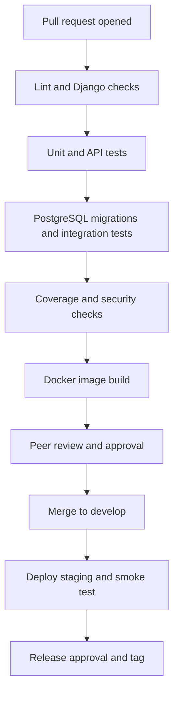
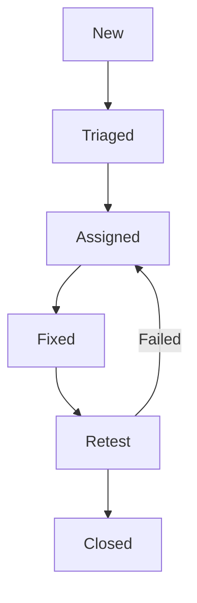

# Testing and Requirements Verification Plan

## Midlands State University Qualification Verification System

| Document item | Value |
|---|---|
| Module | MIM736 – Software Engineering |
| Assignment | DevOps-Enabled Qualification Verification System Using Git and CI/CD Practices |
| Related specification | `docs/REQUIREMENTS.md`, version 0.2 |
| Related traceability matrix | `docs/REQUIREMENTS_TRACEABILITY_MATRIX.md`, version 0.2 |
| Related database design | `docs/DATABASE_ERD.md`, version 0.2 |
| Document version | 0.2 – Updated team-review draft |
| Baseline date | 10 September 2026 |
| Document owner | Audit Trail and QA Lead, supported by all feature owners |
| Approval status | Pending team review and project-lead approval |

## Document control

| Version | Date | Change | Prepared by | Approval |
|---|---|---|---|---|
| 0.1 | 9 September 2026 | Initial test strategy, test catalogue, quality gates and evidence templates | Project team | Pending |
| 0.2 | 10 September 2026 | Updated implementation baseline, evidence and remaining work; retained requirement identifiers | Artwell (`artwel-dev`), with Codex assistance | Pending team review |

## Review baseline and interpretation

Reviewed on **10 September 2026** against `develop` at `77df668f0cb5a0e81118a63ce1439f36ca42cf8c` and the documentation in [PR #8](https://github.com/unclechipaz/qualification_verification_system/pull/8), head `ebc9594e49e17c40678f49c1d9e109753955e62b`. The application code is the same at these two revisions; PR #8 contains documentation changes and was **open, not merged**, when checked.

[PR #4](https://github.com/unclechipaz/qualification_verification_system/pull/4) repaired CI. [PR #6](https://github.com/unclechipaz/qualification_verification_system/pull/6) restricted public registration, applied password validation and checked login redirect destinations; it addresses [issue #5](https://github.com/unclechipaz/qualification_verification_system/issues/5). Both fixes are merged into `develop`. The [develop CI run](https://github.com/unclechipaz/qualification_verification_system/actions/runs/34408020848) and [PR #8 CI run](https://github.com/unclechipaz/qualification_verification_system/actions/runs/34471626306) completed successfully, including Django checks, migration-drift checking, pytest and Docker image building. These runs do not establish coverage, static analysis, PostgreSQL integration, deployment or complete security acceptance.

**Target versus current behaviour:** requirements, proposed controls and unchecked acceptance lists below describe work to deliver or approve. They are not claims of implementation or team sign-off. The assignment requires the four core capabilities, Git collaboration, CI/CD and quality evidence; detailed schema, role, hosting and numerical thresholds in this draft are proposed project decisions unless explicitly attributed to the brief. No additional assessment marks or lecturer requirements are inferred.

These findings apply to the inspected revisions. They do not establish the state of `main`, a live deployment or later commits. Refresh the evidence before release.

## 1. Purpose

This document defines how the MSU Qualification Verification System (MSU QVS) will be tested and how the team will prove that the assignment and system requirements have been satisfied.

It is both a test plan and a verification plan. It covers:

- unit, model, API, web, integration, security, performance and deployment testing;
- requirement-linked test cases and expected results;
- test environments and fictional test data;
- test automation and CI/CD quality gates;
- defect classification and release criteria; and
- evidence required for the repository, technical report, demonstration and individual contribution reports.

This plan does not record a test as passed merely because test code exists. A pass requires an execution result linked to the exact commit tested.

## 2. Assignment alignment

| Assignment requirement | Verification approach | Required evidence |
|---|---|---|
| Unit tests | Automated pytest tests for models, services and utilities | Test names, output and successful CI link |
| Integration tests | Django web/API/database tests using realistic workflows | Test results against clean PostgreSQL |
| Test coverage reporting | Automated coverage measurement in CI | HTML/XML summary and enforced threshold |
| Static code analysis | Automated Python quality and security checks | Tool reports and quality-gate result |
| Coding-standards compliance | Agreed formatter/linter configuration | Configuration and clean CI output |
| Automated verification of requirements | Stable requirement-to-test mapping | Updated RTM and test catalogue |
| Validation rules | Positive, negative and boundary tests | Assertions for accepted and rejected input |
| CI/CD quality gates | Blocking checks on pull requests | GitHub Actions checks and branch protection |
| Verification reports | Reproducible test summary for each release | Test Summary Report and pipeline artifacts |
| Demonstration | Selected acceptance tests repeated in the video | Video timestamps and release identifier |

## 3. Testing principles

1. **Requirement driven:** every test shall reference at least one SRS requirement or acceptance scenario.
2. **Risk based:** access control, personal-data disclosure, certificate status, audit integrity and database persistence receive the highest priority.
3. **Evidence based:** source code, a test, a successful run and the tested commit shall remain traceable.
4. **Independent review:** the feature author writes tests, while another member reviews the implementation and evidence.
5. **Repeatable:** tests shall run from a clean checkout using deterministic fictional data.
6. **Production-like integration:** unit tests may use SQLite, but database migrations and integration tests shall also run against PostgreSQL 16.
7. **No real personal data:** test identities shall be fictional and use reserved example values.
8. **No manufactured history:** empty commits, relabelled commits or fabricated screenshots shall not be accepted as test evidence.
9. **Failures remain visible:** failed tests shall be corrected or recorded as accepted risk; they shall not be deleted simply to make CI green.
10. **Coverage supports quality:** a coverage percentage does not replace meaningful assertions for critical behaviour.

## 4. Current baseline test assessment

### 4.1 Existing automated tests

The repository currently contains **13 test functions**: nine authentication, three verification-lookup and one rule-scoring test. Six authentication regressions were added in PR #6. Their names and scope are recorded below. The existing suite passed locally and its CI step succeeded at the inspected baseline; these results do not pass the entire target catalogue or establish coverage.

| Existing test | Source | Behaviour exercised | Requirement coverage | Limitation | Baseline status |
|---|---|---|---|---|---|
| `test_user_creation_with_role` | `tests/test_authentication.py` | Creates a Registrar and checks helper method | FR-IAM-05, model role support | Does not test who may assign the role | Existing test; baseline suite passes (Section 4.4) |
| `test_api_login_success` | `tests/test_authentication.py` | Username/password API login and token response | FR-IAM-01 | Does not test email login, expiry or response privacy | Existing test; baseline suite passes (Section 4.4) |
| `test_api_login_failure` | `tests/test_authentication.py` | Invalid API credentials return 401 | FR-IAM-08 | Does not cover enumeration, disabled users or throttling | Existing test; baseline suite passes (Section 4.4) |
| `test_verification_by_cert_number` | `tests/test_verification.py` | Service lookup by certificate number | FR-VER-01, FR-SRCH-03 | Does not test HTTP response, permissions or logging | Existing test; baseline suite passes (Section 4.4) |
| `test_verification_by_student_number` | `tests/test_verification.py` | Service lookup by student number | FR-SRCH-01, FR-SRCH-03 | Does not distinguish protected internal search from public verification | Existing test; baseline suite passes (Section 4.4) |
| `test_invalid_verification_query` | `tests/test_verification.py` | Unknown query returns no certificate | FR-VER-06 | Does not test safe response or privacy-safe log | Existing test; baseline suite passes (Section 4.4) |
| `test_revoked_certificate_fraud_detection` | `tests/test_ai_fraud.py` | Revoked certificate increases rule score | FR-RPT-04, FR-RPT-05 | Tests one deterministic rule, not certificate verification status | Existing test; baseline suite passes (Section 4.4) |
| `test_web_registration_rejects_privileged_role` | `tests/test_authentication.py` | Web self-registration rejects ADMINISTRATOR | FR-IAM-03, TC-IAM-005 | One privileged value on this route; extend role matrix | Existing regression; baseline suite passes |
| `test_web_registration_enforces_password_validation` | `tests/test_authentication.py` | Web rejects common weak password | NFR-SEC-05, TC-IAM-012 | Does not cover all validators/malformed fields | Existing regression; baseline suite passes |
| `test_api_registration_rejects_privileged_role` | `tests/test_authentication.py` | API self-registration rejects REGISTRAR | FR-IAM-03, TC-IAM-005 | One privileged value on this route; extend role matrix | Existing regression; baseline suite passes |
| `test_api_registration_enforces_password_validation` | `tests/test_authentication.py` | API rejects common weak password | NFR-SEC-05, TC-IAM-012 | Does not cover all validators/response privacy | Existing regression; baseline suite passes |
| `test_login_rejects_external_next_redirect` | `tests/test_authentication.py` | Rejects off-site next URL after login | FR-IAM-10, TC-IAM-011 | Extend host/scheme/proxy edge cases | Existing regression; baseline suite passes |
| `test_login_allows_local_next_redirect` | `tests/test_authentication.py` | Allows safe local next URL | FR-IAM-10, TC-IAM-011 | Does not prove deployment host restrictions | Existing regression; baseline suite passes |

### 4.2 Current pytest configuration

`pytest.ini` identifies Django settings and test-file patterns and currently adds `--nomigrations --tb=short`.

The `--nomigrations` option skips execution of the application migrations in the normal test setup. CI's successful drift check does not prove that migrations apply. Add a clean PostgreSQL job running real migrations and integration tests.

From the repository root, use the current CI invocation:

```bash
python backend/manage.py check
python backend/manage.py makemigrations --check --dry-run
python -m pytest --tb=short
```

The proposed PostgreSQL job must supply the implemented `DB_*` variables for an isolated CI database with permission to create a test database. After installing the project's dependencies, its checks should include:

```bash
python backend/manage.py migrate --noinput
python -m pytest -o addopts="--tb=short" --migrations
```

These commands are a target job contract, not an assertion that the repository already defines a PostgreSQL service. Use `python -m pytest` from the root; bare `pytest` was implicated in the import/discovery failure repaired by PR #4.

### 4.3 Current CI workflow

After [PR #4](https://github.com/unclechipaz/qualification_verification_system/pull/4), `.github/workflows/ci_cd.yml`:

- triggers on pushes to `main`, `develop` and `feature/*`, and pull requests targeting `main` or `develop`;
- grants workflow token permission `contents: read`;
- sets up Python 3.13 and installs `requirements.txt`;
- runs Django system checks and `makemigrations --check --dry-run`;
- invokes `python -m pytest --tb=short`;
- builds the Docker image only after those checks succeed.

The displayed test job is **Build & Test (Python 3.13)**. Its internal identifier remains `test-and-lint`, but there is no lint command. There are also no coverage reports/thresholds, dependency or security scans, PostgreSQL integration service, image publication or controlled deployment stage in this workflow.

### 4.4 Baseline execution evidence and limitations

| Evidence | Exact source / environment | Observed result | Limit |
|---|---|---|---|
| Merged code CI | `develop` at `77df668f0cb5a0e81118a63ce1439f36ca42cf8c`; [develop CI run](https://github.com/unclechipaz/qualification_verification_system/actions/runs/34408020848) | Test/check job and Docker-build job succeeded on 9 September 2026 | Configured checks only; inspect linked logs for run details |
| Documentation PR CI | PR #8 head `ebc9594e49e17c40678f49c1d9e109753955e62b`; [PR #8 CI run](https://github.com/unclechipaz/qualification_verification_system/actions/runs/34471626306) | Both jobs succeeded on 10 September 2026 | PR event tests the checkout selected by the workflow; it is not a deployed release |
| Local existing test suite | Code at `0faeb043c8c2c602008b1c7e1d45eb29efdcd098`, equivalent application code; Python 3.12.14, Django 5.1.15, DRF 3.17.2, pytest 9.1.1 | 13 passed; Django check clean; no migration drift, recorded during the 10 September documentation verification | Local runtime differs from CI's Python 3.13; no coverage measurement |
| Local documentation behaviour checks | Isolated SQLite database and synthetic records, same application code | Fresh migrations/seed, response fields/statuses, separate issuance, profile creation and access limitations checked | Supplementary checks are not 13 additional tests or completed release acceptance |

The old statement that all CI runs failed describes the 7 September assessment. It is superseded by the linked successful runs. No successful PostgreSQL integration, browser QR decoding, load test, live-deployment audit, backup/restore, coverage or static-analysis result is claimed here.

The local checks reproduced remaining defects: a suspended certificate returns API `PENDING` but the web invalid-result panel; a logged-in user can access other certificate pages; a verification PDF is public; saving a Student does not issue a Certificate. Confirming that a defect exists is **not** passing its acceptance test.

### 4.5 How to use the catalogue

The catalogue below is the target verification plan, not a list of already implemented pytest functions. “Existing/partial” means related automation covers only part of the complete scenario. “Planned” does not mean Passed or Failed; use Not Run/Blocked until an executable case is run and record actual results in Section 16. Never convert expected outcomes into fabricated evidence.

## 5. Roles and responsibilities

| Role/member | Testing responsibility |
|---|---|
| Charlton — Project Lead and DevOps Architect | Own CI/CD, test environments, Docker build, deployment tests, branch protection and final release evidence. |
| Simba — Database and Registry Lead | Test models, constraints, migrations, registration, certificate issuance, transactions and database recovery. |
| Mncedisi (Artwell) — Search and Retrieval Specialist | Test every search parameter, combined filters, duplicate names, masking, authorisation, pagination, query plans and performance. |
| Doreen — Verification and Frontend UI Specialist | Test verification statuses, QR flow, PDF output, role-specific displays, usability, responsiveness and accessibility. |
| Cleopatra — Audit Trail and QA Lead | Maintain this plan and RTM, coordinate test coverage/static analysis, test audit/reporting, review evidence and prepare the Test Summary Report. |
| Every feature author | Add tests in the same pull request as the implementation and correct failures attributable to the change. |
| Independent reviewer | Confirm requirement mapping, negative cases, test quality and CI results before approval. |

No member shall approve their own feature pull request as the only reviewer.

## 6. Test levels and verification methods

| Level/method | Purpose | Typical scope | Automation expectation |
|---|---|---|---|
| Unit test | Verify one function or rule in isolation | Identifier generation, masking, validators, status mapping | Automated |
| Model/constraint test | Verify schema rules and model behaviour | Unique fields, relationships, protected deletion, conditional validation | Automated |
| API test | Verify request, permission, validation and response contracts | Login, search, verification, reports and CRUD endpoints | Automated |
| Web integration test | Verify server-rendered workflows | Registration, dashboard, search, verification and downloads | Automated where practical |
| Database integration test | Verify real migrations and PostgreSQL behaviour | Constraints, transactions, indexes and persistence | Automated in CI |
| Security test | Verify misuse is rejected safely | Privilege escalation, object access, data disclosure, throttling, redirects | Automated plus review |
| Static analysis | Detect coding, security and dependency issues | Python source and dependencies | Automated in CI |
| Performance test | Measure response/query behaviour under a stated workload | Exact verification, multi-parameter search and reports | Scripted, repeatable |
| Accessibility/usability test | Verify understandable and operable interfaces | Keyboard use, labels, contrast, viewport and status messaging | Automated plus manual |
| Deployment smoke test | Verify the deployed release and dependencies | Health, database, static assets and core read-only verification | Automated after deployment |
| User acceptance test | Confirm business workflows satisfy expected outcomes | Four core assignment capabilities | Controlled manual test |
| Inspection | Confirm a document/configuration matches implementation | API docs, manuals, diagrams and environment variables | Peer-reviewed checklist |
| Demonstration | Show selected working behaviour to the assessor | System, Git workflow, CI/CD, tests and verification | Recorded against release tag |

## 7. Test environments

| Environment | Purpose | Database | Data | Required controls |
|---|---|---|---|---|
| Developer local | Fast development and focused tests | SQLite permitted or local PostgreSQL | Fictional fixtures | Debug allowed; secrets local and ignored by Git |
| CI unit | Repeatable pull-request unit/API suite | SQLite permitted | Test-created fictional data | Clean checkout; deterministic settings |
| CI integration | Migration and PostgreSQL-specific behaviour | PostgreSQL 16 service | Test-created fictional data | Real migrations; no `--nomigrations` |
| Docker validation | Build and start the packaged application | PostgreSQL 16 container | Minimal fictional seed | Health check; immutable build context |
| Staging | End-to-end, security, usability and deployment verification | Persistent PostgreSQL | Fictional demonstration data | Production-like settings; restricted access where possible |
| Demonstration release | Assessor-accessible final system | Persistent PostgreSQL | Approved fictional demonstration data | HTTPS, debug disabled, secrets protected, monitored availability |

Production or staging tests shall never use the temporary Vercel SQLite copy as authoritative evidence of persistence.

## 8. Test-data design

### 8.1 Minimum fictional dataset

| Fixture | Required records and purpose |
|---|---|
| Users | One Administrator, one Registrar, one Graduate, two Employers, one Public Verifier and one disabled user |
| Employer approval | One verified and one unverified employer |
| Qualifications | At least two qualifications with different codes/faculties |
| Active certificates | At least two, including two certificates linked to one student after DR-03 is implemented |
| Revoked certificate | One with an approved revocation reason, actor and timestamp |
| Suspended certificate | One for status-mapping tests |
| Duplicate-name students | At least two different students whose names satisfy the same partial query |
| Invalid identifiers | Well-formed unknown value, malformed value, empty value and overlength value |
| Audit history | Successful and denied changes by different roles |
| Verification history | Valid, revoked, suspended and invalid results belonging to different employers and anonymous users |

### 8.2 Safe test-value convention

- Use names such as `Test Graduate Alpha` and `Test Graduate Beta`.
- Use reserved email domains such as `registrar@example.test`.
- Use visibly fictional identifiers such as `TEST-NID-0001` and `TEST-STU-0001`.
- Never copy National IDs, phone numbers, passwords or emails belonging to team members or real students.
- Create test data inside tests or controlled fixtures; do not depend on the committed `backend/db.sqlite3`.
- Store test secrets only in protected CI variables and use non-production values.

## 9. Entry, suspension and exit criteria

### 9.1 Test-entry criteria

Testing for a pull request may begin when:

- a GitHub issue and acceptance criteria exist;
- the branch was created from the approved baseline;
- code and migrations required by the feature are present;
- test data is fictional and reproducible;
- the author has linked changed requirements; and
- the application starts or the failure is the explicit subject of the test.

### 9.2 Test-suspension criteria

Testing shall pause and the blocker shall be recorded when:

- migrations cannot create a clean database;
- environment configuration exposes a real secret;
- a critical privilege-escalation or public personal-data leak is discovered;
- the test environment cannot be related to a known commit;
- fixtures contain real personal data; or
- infrastructure instability makes results non-reproducible.

### 9.3 Pull-request exit criteria

A feature pull request may be approved only when:

- its acceptance tests pass;
- relevant regression tests pass;
- new/changed requirements are represented in the RTM;
- lint, static analysis and migration checks pass;
- coverage meets the approved gate or an authorised exception is documented;
- the change introduces no uncontained Critical/High defect and meets its agreed scope; existing unrelated blockers remain recorded for release; and
- a reviewer other than the author approves the change.

These are target feature gates. A documentation-only or focused remediation PR can be reviewed while unrelated release blockers remain open; it must not claim those blockers are solved. Record which configured checks actually ran.

### 9.4 Release exit criteria

The release candidate shall not be tagged until:

1. all four core assignment capabilities pass end-to-end acceptance testing;
2. critical permission, privacy, status and audit tests pass;
3. the complete suite passes against a clean PostgreSQL database;
4. coverage is reported and meets the approved release threshold;
5. static and dependency analysis meet the quality gates;
6. the Docker image builds and the deployment smoke tests pass;
7. backup/restore and rollback evidence is available;
8. user, administrator, API, architecture and deployment documents match the release;
9. every team member's contribution evidence is traceable; and
10. the project lead and QA lead approve the Test Summary Report.

## 10. Automated quality gates

The following are target gates. Commands shall be added to the repository only when the corresponding dependency and configuration are committed.

| Gate | Target check | Proposed acceptance rule |
|---|---|---|
| QG-01 Source quality | Ruff or an approved equivalent | No unapproved lint errors |
| QG-02 Django configuration | `manage.py check` | No system-check errors |
| QG-03 Migration consistency | `makemigrations --check --dry-run` | No uncommitted model changes |
| QG-04 PostgreSQL migration | `migrate` on a clean PostgreSQL service | All migrations apply successfully |
| QG-05 Automated tests | Pytest unit and integration suites | All tests pass |
| QG-06 Coverage | Pytest coverage report | Proposed minimum 80% line coverage for project code |
| QG-07 Critical-flow coverage | Requirement/test mapping | Every core acceptance scenario has at least one passing test |
| QG-08 Security static analysis | Bandit or approved equivalent | No unresolved High issue; Medium issues reviewed |
| QG-09 Dependency analysis | `pip-audit` or approved equivalent | No unaccepted Critical/High known vulnerability |
| QG-10 Deployment settings | `manage.py check --deploy` using production-like settings | No unapproved deployment warning |
| QG-11 Container build | Docker build | Image builds successfully from clean checkout |
| QG-12 Staging smoke test | Health, database, static assets and core verification | Every smoke check passes |

The assignment requires coverage reporting but does not specify 80%. This is a proposed team threshold, not an achieved result or a lecturer-imposed percentage. Once approved, changing it requires a documented team decision rather than silently lowering CI requirements.

### 10.1 Target pipeline sequence



Production deployment, if demonstrated, shall require an explicit approval after the tested release commit is identified.

## 11. Detailed functional test catalogue

`Planned` means the case is required but no passing automated evidence has yet been linked. `Existing/partial` means related test code exists but does not yet prove the full expected result.

### 11.1 Identity and access tests

| Test ID | Requirements | Scenario | Expected result | Type/status |
|---|---|---|---|---|
| TC-IAM-001 | FR-IAM-01 | Log in through API with valid username/password. | 200 response, authenticated user and protected token response. | API; existing/partial |
| TC-IAM-002 | FR-IAM-01 | Log in through web using a unique registered email. | Authenticated session and safe dashboard redirect. | Web integration; planned |
| TC-IAM-003 | FR-IAM-08 | Submit unknown username/email and wrong password. | Generic failure with no account-existence disclosure. | API/web; existing/partial |
| TC-IAM-004 | FR-IAM-02 | Log out then request a protected page with the old session. | Session rejected and login required. | Web integration; planned |
| TC-IAM-005 | FR-IAM-03, NFR-SEC-01 | Self-register while submitting Administrator or Registrar role on web and API. | Reject the role; create no account. | Security integration; existing/partial — web ADMINISTRATOR and API REGISTRAR regressions pass; expand both routes to both values |
| TC-IAM-006 | FR-IAM-04 | Registrar attempts to assign Administrator role; Administrator performs approved change. | Registrar denied; Administrator action permitted and audited. | Permission integration; planned |
| TC-IAM-007 | FR-IAM-05, AC-PERM-01 | Exercise every protected endpoint with every role. | Matrix-consistent 2xx/3xx/403 results and no unauthorised change. | Parameterised API/web; planned |
| TC-IAM-008 | FR-IAM-06 | Verified and unverified employers request employer portal. | Only approved employer obtains employer privileges. | Permission integration; planned |
| TC-IAM-009 | FR-IAM-07 | Graduate requests own and another graduate's record. | Own record allowed; other record denied/not disclosed. | Object-permission; planned |
| TC-IAM-010 | FR-IAM-09 | Use expired/revoked token after lifecycle is implemented. | 401 response; token cannot be reused. | API security; planned |
| TC-IAM-011 | FR-IAM-10 | Submit external and safe local login `next` destinations. | External URL rejected; safe local redirect permitted. | Security regression; existing two cases pass; host/scheme edge cases pending |
| TC-IAM-012 | NFR-SEC-05, NFR-SEC-06 | Register using weak password and malformed fields. | Controlled validation errors; no account created. | Validation integration; existing web/API weak-password tests pass; other validation cases pending |

### 11.2 Registration and certificate tests

| Test ID | Requirements | Scenario | Expected result | Type/status |
|---|---|---|---|---|
| TC-REG-001 | FR-REG-01, DR-04 | Registrar creates a valid qualification. | Record stored with unique code and audit event. | API/model; planned |
| TC-REG-002 | FR-REG-03, DR-04 | Create a qualification using an existing code. | Controlled validation response; original unchanged. | API/model; planned |
| TC-REG-003 | FR-REG-02 | Registrar creates a valid student. | Student stored with all mandatory attributes. | Web/API integration; planned |
| TC-REG-004 | FR-REG-03, DR-01, AC-REG-02 | Create a duplicate student number. | Rejected without partial record. | Model/API; planned |
| TC-REG-005 | FR-REG-03, DR-02, AC-REG-02 | Create a duplicate National ID. | Rejected safely without exposing another record. | Model/API; planned |
| TC-REG-006 | FR-REG-03, NFR-SEC-06 | Omit mandatory values and submit invalid dates/choices. | Field-specific 4xx/form errors; no server error. | Validation; planned |
| TC-REG-007 | FR-REG-04, AC-REG-01 | Issue certificate for an existing student and qualification. | Linked certificate, identifiers and audit evidence created. | Integration; planned |
| TC-REG-008 | FR-REG-05, DR-05 | Issue many certificates through approved generator. | No duplicate certificate or verification code. | Model/integration; planned |
| TC-REG-009 | FR-REG-06, DR-03 | Issue two qualifications to one student. | Two certificates link to one Student after migration. | PostgreSQL integration; planned |
| TC-REG-010 | FR-REG-07 | Issue certificate without explicit status where default is permitted. | Status is ACTIVE and documented. | Model; planned |
| TC-REG-011 | FR-REG-08, FR-REG-09, DR-07 | Revoke with/without required reason and authorised actor. | Missing reason rejected; valid revocation records actor/time. | Integration; planned |
| TC-REG-012 | DR-08, FR-REG-08 | Attempt invalid or conflicting student/certificate status transition. | Transition rejected or valid outcome prevented. | Model/service; planned |
| TC-REG-013 | FR-REG-10 | Generate QR for issued certificate. | QR contains approved verification URL/code and no National ID. | Unit/integration; planned |
| TC-REG-014 | DR-06, NFR-REL-01 | Force failure midway through issuance. | Database transaction rolls back every partial write. | PostgreSQL integration; planned |
| TC-REG-015 | FR-REG-11 | Create, update, suspend and revoke records. | One complete, safe audit event per action. | Integration; planned |
| TC-REG-016 | FR-REG-12 | Compare student form wording with actual submitted transaction. | Wording accurately describes whether certificate issuance occurs. | Inspection/web; planned |

### 11.3 Search and retrieval tests

| Test ID | Requirements | Scenario | Expected result | Type/status |
|---|---|---|---|---|
| TC-SRCH-001 | FR-SRCH-01, FR-SRCH-03 | Authorised exact certificate-number search. | Correct unique record returned. | Service/API; existing/partial |
| TC-SRCH-002 | FR-SRCH-01, FR-SRCH-03 | Authorised exact student-number search. | Correct authorised record returned. | Service/API; existing/partial |
| TC-SRCH-003 | FR-SRCH-01, FR-SRCH-03 | Authorised exact National-ID search. | Correct record returned only to permitted role. | API security; planned |
| TC-SRCH-004 | FR-SRCH-03, FR-VER-01 | Exact verification-code search. | Correct certificate returned. | Service/API; planned |
| TC-SRCH-005 | FR-SRCH-04 | Authorised case-insensitive partial-name search. | All matching records returned. | API; planned |
| TC-SRCH-006 | FR-SRCH-05, AC-SRCH-02 | Search a name shared by two students. | Result set contains both; no silent first-record selection. | API; planned |
| TC-SRCH-007 | FR-SRCH-02, AC-SRCH-01 | Submit separate student-number and name filters; test any approved qualification/faculty extension separately. | Supplied filters combine using documented AND behaviour. | API; planned |
| TC-SRCH-008 | FR-SRCH-11 | Submit no search criteria. | Controlled 400/form message; no unrestricted data dump. | API/web; planned |
| TC-SRCH-009 | FR-SRCH-11, NFR-SEC-06 | Submit overlength, malformed and unusual-character inputs. | Controlled response; no traceback or unsafe query behaviour. | Boundary/security; planned |
| TC-SRCH-010 | FR-SRCH-09, NFR-PERF-03 | Create more than 20 matches and request pages. | Stable 20-record pages with correct navigation/count. | API/web; planned |
| TC-SRCH-011 | FR-SRCH-08, AC-PERM-01 | Anonymous user searches student number, National ID or name. | Request rejected or treated as invalid without disclosure. | Security integration; planned |
| TC-SRCH-012 | FR-SRCH-07, NFR-SEC-08 | Inspect public and ordinary result lists. | Full National ID absent; approved mask used where required. | API/template; planned |
| TC-SRCH-013 | FR-SRCH-06 | Compare Public, Employer, Registrar and Administrator result fields. | Each role receives only its authorised schema. | Parameterised API; planned |
| TC-SRCH-014 | FR-SRCH-15 | Submit equivalent searches through web and API. | Same matching, authorisation and disclosure policy. | Integration; planned |
| TC-SRCH-015 | FR-SRCH-14, FR-AUD-08 | Search using a National ID then inspect stored verification/audit data. | Stored/exported value is masked or protected. | Database/security; planned |
| TC-SRCH-016 | FR-SRCH-12, NFR-SEC-07 | Exceed approved login/verification/search request rate. | 429 response after threshold; normal use remains available. | API security; planned |
| TC-SRCH-017 | FR-SRCH-03 | Add surrounding whitespace and change identifier case. | Input normalises according to documented exact-match rule. | Unit/API; planned |
| TC-SRCH-018 | FR-SRCH-10, NFR-PERF-04 | Execute representative indexed queries with query-plan capture. | Approved index is used or documented alternative is justified. | PostgreSQL analysis; planned |
| TC-SRCH-019 | NFR-PERF-01, NFR-PERF-02 | Run exact verification workload on documented dataset/concurrency. | At least 95% complete within two seconds. | Performance; planned |
| TC-SRCH-020 | NFR-PERF-04 | Measure database query count for search result serialisation. | No unapproved N+1 query growth. | Performance regression; planned |
| TC-SRCH-021 | FR-SRCH-13 | Compare public invalid responses for unknown certificate values and restricted identifiers. | Responses do not reveal whether a National ID, student account or other restricted identifier exists. | API privacy; planned |

### 11.4 Verification, QR and PDF tests

| Test ID | Requirements | Scenario | Expected result | Type/status |
|---|---|---|---|---|
| TC-VER-001 | FR-VER-01, FR-VER-03, AC-VER-01 | Verify an ACTIVE certificate by exact identifier. | VERIFIED response, minimised details and log. | End-to-end; existing/partial |
| TC-VER-002 | FR-VER-04, AC-VER-02 | Verify a REVOKED certificate. | REVOKED response; never shown as valid; log created. | End-to-end; planned |
| TC-VER-003 | FR-VER-05 | Verify a SUSPENDED certificate. | Approved SUSPENDED/PENDING term used consistently. | End-to-end; planned |
| TC-VER-004 | FR-VER-06, AC-VER-03 | Verify a well-formed unknown identifier. | Generic INVALID/NOT FOUND response and privacy-safe log. | End-to-end; existing/partial |
| TC-VER-005 | FR-VER-02 | Scan a valid generated QR code. | Approved identifier reaches normal verification service. | Browser integration; planned |
| TC-VER-006 | FR-VER-02, NFR-SEC-06 | Scan malformed or external QR content. | Content rejected safely; no arbitrary redirect/navigation. | Browser security; planned |
| TC-VER-007 | FR-VER-07, NFR-SEC-08 | Compare result content across roles. | Only required qualification/personal fields are exposed. | API/template; planned |
| TC-VER-008 | FR-VER-08, NFR-USE-05 | Inspect every verification status. | Text/icon identifies status without relying only on colour. | Template/accessibility; planned |
| TC-VER-009 | FR-VER-09 | Generate PDF for approved verification outcomes. | Readable statement matches displayed result and timestamp. | PDF integration; planned |
| TC-VER-010 | FR-VER-10, AC-PERM-01 | Request another user's PDF using guessed sequential `log_id`. | Access denied/not found; no information disclosed. | Object-security; planned |
| TC-VER-011 | FR-VER-12, FR-AUD-01 | Verify valid, revoked, suspended and invalid identifiers. | Exactly one correctly classified VerificationLog per request. | Database integration; planned |
| TC-VER-012 | FR-VER-11, DR-12 | Alter a field covered by the approved integrity digest. | Verification detects mismatch or no integrity claim is displayed. | Unit/integration; planned |
| TC-VER-013 | DR-08, FR-VER-03 | Use ACTIVE certificate linked to inconsistent/revoked student state. | System does not return VERIFIED. | Model/service; planned |
| TC-VER-014 | FR-REG-05, FR-VER-01 | Attempt to predict or enumerate verification codes. | Codes are sufficiently random; throttling limits repeated attempts. | Analysis/security; planned |

### 11.5 Audit, reporting and rule-indicator tests

| Test ID | Requirements | Scenario | Expected result | Type/status |
|---|---|---|---|---|
| TC-AUD-001 | FR-AUD-01, FR-AUD-02 | Complete each verification outcome. | Required type/result/actor/time/source fields are recorded safely. | Integration; planned |
| TC-AUD-002 | FR-AUD-03, FR-AUD-04 | Administrator creates/updates a qualification record. | Domain target, actor, outcome and safe change detail recorded. | Integration; planned |
| TC-AUD-003 | FR-AUD-03, FR-AUD-04, AC-AUD-01 | Registrar changes certificate status. | Safe before/after status, target, actor and time recorded. | Integration; planned |
| TC-AUD-004 | FR-AUD-03 | Unauthorised user attempts protected data change. | No data change; denied attempt recorded according to policy. | Security integration; planned |
| TC-AUD-005 | FR-AUD-05 | Ordinary user/API attempts to edit or delete audit record. | Operation denied and evidence retained. | Permission/model; planned |
| TC-AUD-006 | FR-AUD-06 | Each role requests complete audit/report pages/APIs. | Only Administrator/Registrar receive approved complete view. | Parameterised permission; planned |
| TC-AUD-007 | FR-AUD-07 | Two employers create separate verification histories. | Each sees/exports only its own history. | Integration; planned |
| TC-AUD-008 | FR-AUD-08, NFR-SEC-08 | Export records containing restricted query types. | National ID and unnecessary source data are masked/omitted. | CSV security; planned |
| TC-AUD-009 | FR-AUD-11 | Submit password/token-like values through protected workflows. | Secrets do not appear in audit or verification logs. | Security regression; planned |
| TC-AUD-010 | FR-AUD-09 | Execute approved retention/archive process on dated fixtures. | Only eligible records handled; evidence and failures recorded. | Database/operations; planned after decision |
| TC-AUD-011 | FR-AUD-10, FR-RPT-01 | Generate daily, seven-day and thirty-day summaries. | Counts match deterministic fixture timestamps/statuses. | Reporting integration; planned |
| TC-AUD-012 | FR-RPT-02 | Export report as Administrator, Registrar, Employer and unauthorised role. | Correct scope for allowed roles; denied for others. | Permission integration; planned |
| TC-AUD-013 | FR-RPT-03 | Inspect UI, CSV and PDF report metadata. | Criteria and generation timestamp are present and accurate. | Output inspection; planned |
| TC-AUD-014 | FR-AUD-12 | Simulate essential audit-write failure. | Approved fail-safe response/alert occurs; no silent loss. | Failure injection; planned after policy decision |
| TC-AUD-015 | FR-RPT-04 | Exercise every documented anomaly rule at boundary values. | Score, flag and reason exactly match documented thresholds. | Unit; existing/partial |
| TC-AUD-016 | FR-RPT-05, FR-RPT-06 | Trigger high anomaly score. | Indicator does not autonomously revoke/block and UI does not call it proof. | Unit/template; planned |
| TC-AUD-017 | FR-AUD-08 | Export a query beginning with `=`, `+`, `-` or `@`. | CSV neutralises spreadsheet-formula execution risk. | Security; planned |

## 12. Database and migration test catalogue

| Test ID | Requirements | Scenario | Expected result | Status |
|---|---|---|---|---|
| TC-DB-001 | NFR-MNT-04, NFR-REL-05 | Apply all committed migrations to empty PostgreSQL 16 database. | Migration completes without runtime model generation. | Planned |
| TC-DB-002 | NFR-MNT-04 | Run migration-drift check after model changes. | No uncommitted migration detected. | Existing CI check passed at baseline; does not replace TC-DB-001 |
| TC-DB-003 | DR-01, DR-02, DR-04, DR-05 | Attempt duplicate values at database and API layers. | Constraints hold; user receives controlled validation response. | Planned |
| TC-DB-004 | DR-03 | Store multiple certificates for one student after migration. | Valid 1:N relationship; no duplicate student identity. | Planned |
| TC-DB-005 | DR-06, NFR-REL-01 | Inject failure during issuance transaction. | Complete rollback. | Planned |
| TC-DB-006 | DR-07 | Save REVOKED certificate without reason/actor/time. | Conditional validation rejects record. | Planned |
| TC-DB-007 | DR-08 | Save conflicting student and certificate statuses. | Constraint/service rejects or prevents VERIFIED outcome. | Planned |
| TC-DB-008 | NFR-REL-05 | Attempt deletion of referenced Qualification. | Protected deletion error; certificates remain. | Planned |
| TC-DB-009 | NFR-REL-02, DR-10 | Create record, restart/redeploy application and read record. | Record persists in PostgreSQL. | Planned |
| TC-DB-010 | NFR-REL-03 | Back up fictional staging database and restore to isolated database. | Counts, constraints and sample checks match. | Planned |
| TC-DB-011 | FR-RPT-04 | Store anomaly score below 0 and above 100 after constraint implementation. | Database/model rejects invalid values. | Planned |
| TC-DB-012 | Deletion rules in `DATABASE_ERD.md` | Test User, Student, Certificate and Qualification deletion decisions. | Behaviour matches approved retention/deletion catalogue. | Planned |
| TC-DB-013 | DR-09 | Create events around a UTC/Africa-Harare date boundary and inspect storage and display. | Timestamps are stored consistently and displayed using the approved business timezone where applicable. | PostgreSQL/web integration; planned |
| TC-DB-014 | DR-11, NFR-TEST-06 | Scan test fixtures and demonstration seed data, then run the suite from a clean checkout. | Data is deterministic and visibly fictional; no real student or team-member personal data is present. | Data inspection/CI; planned |

## 13. Non-functional and deployment test catalogue

| Test ID | Requirements | Scenario | Expected result | Status |
|---|---|---|---|---|
| TC-NFR-001 | NFR-SEC-02, NFR-SEC-09 | Run Django deployment checks using production-like settings. | No unapproved deployment warning. | Planned |
| TC-NFR-002 | NFR-SEC-03 | Scan repository and built configuration for committed secrets. | No real secret/default production credential found. | Planned |
| TC-NFR-003 | NFR-SEC-04 | Submit cross-site state-changing request and unapproved Origin/Host. | CSRF/origin/host control rejects request. | Planned |
| TC-NFR-004 | NFR-SEC-05 | Create user then inspect database/API/logs. | Password is hashed and never returned/logged. | Planned |
| TC-NFR-005 | NFR-SEC-06, NFR-REL-04 | Trigger representative validation and server errors with debug disabled. | Safe 4xx/5xx response; no traceback/secret disclosure. | Planned |
| TC-NFR-006 | NFR-MNT-02, NFR-TEST-05 | Run approved lint/static-analysis configuration. | No blocking issue. | Planned |
| TC-NFR-007 | NFR-TEST-04 | Run complete coverage command. | Report generated and approved threshold met. | Planned |
| TC-NFR-008 | NFR-USE-01, NFR-USE-02 | First-time user completes exact verification. | Task completes without assistance; messages are understandable. | Manual UAT; planned |
| TC-NFR-009 | NFR-USE-03, NFR-USE-05 | Navigate forms/results by keyboard and inspect accessible names/contrast. | Critical workflow is operable and statuses understandable. | Accessibility; planned |
| TC-NFR-010 | NFR-USE-04 | Test approved mobile, tablet and desktop viewport widths. | No clipped controls or unusable horizontal page scrolling. | Browser/manual; planned |
| TC-NFR-011 | NFR-MNT-05 | Follow installation guide on clean environment. | Application starts and tests run using documented commands. | Reproducibility; planned |
| TC-NFR-012 | NFR-MNT-06, NFR-DEV-09 | Build Docker image from clean checkout. | Image build succeeds and identifies tested commit. | Existing CI build passed; runtime health/PostgreSQL acceptance remains separate |
| TC-NFR-013 | NFR-OPS-01, NFR-OPS-06 | Call staging health check and core read-only verification. | Application/database healthy and expected result returned. | Deployment smoke; planned |
| TC-NFR-014 | NFR-MNT-03, NFR-OPS-03 | Compare environment-variable guide with settings and platform configuration. | Environment-specific values are configured once, names/default expectations align and secret values remain unpublished. | Inspection; planned |
| TC-NFR-015 | NFR-OPS-04 | Roll back a non-production release. | Previous approved release restored without losing persistent data. | Deployment exercise; planned |
| TC-NFR-016 | NFR-OPS-05 | Request CSS, JavaScript, logo, QR/media and core pages after deployment. | Required assets return successful responses and render. | Deployment smoke; planned |
| TC-NFR-017 | NFR-DEV-01, NFR-DEV-02, NFR-DEV-03, NFR-DEV-04 | Inspect issue, focused branch, content-changing commits, PR and independent review for selected feature. | Complete genuine trace from requirement to merge, with truthful authorship and commit messages. | Repository inspection; planned |
| TC-NFR-018 | NFR-DEV-05, NFR-DEV-09 | Inspect required checks on pull request and deployment workflow. | Green checks block/permit merge as configured; controlled delivery succeeds. | GitHub evidence; planned |
| TC-NFR-019 | NFR-DEV-06 | Review documented genuine merge conflict. | Conflicting changes, resolution and retest are visible. | Repository inspection; planned |
| TC-NFR-020 | NFR-DEV-07 | Compare release tag, tested SHA and deployed version. | All identify the same approved source state. | Release verification; planned |
| TC-NFR-021 | NFR-DEV-08 | Inspect new contribution history. | No automated empty commit is presented as member work. | Repository inspection; planned |
| TC-NFR-022 | NFR-MNT-01 | Compare implemented Django apps/modules with the approved architecture and responsibilities. | Authentication, students, qualifications, verification, employers, audit and reports have clear, maintainable boundaries. | Architecture inspection; planned |
| TC-NFR-023 | NFR-OPS-02, DR-10, NFR-REL-02 | Inspect deployment configuration and repeat a write/restart/read exercise. | Shared deployment uses persistent PostgreSQL or another approved persistent database; no temporary SQLite system of record is used. | Deployment integration; planned |
| TC-NFR-024 | NFR-TEST-01, NFR-TEST-02, NFR-TEST-03, NFR-TEST-07 | Reconcile automated tests and this catalogue with the RTM before release. | Core areas include positive, invalid, duplicate, unauthorised and boundary tests; all search behaviours and requirement links are represented. | QA inspection; planned |

Dependency support review is also required before release: the current Django range excludes supported releases (SEC-RISK-020). After a reviewed dependency change, rerun the suite, migration checks, package build and security analysis. Passing tests alone does not establish upstream security support.

## 14. Manual user-acceptance test script

The final UAT shall be performed against the release candidate, not an uncommitted local copy.

| UAT ID | Actor | Business task | Expected outcome | Result/evidence |
|---|---|---|---|---|
| UAT-01 | Registrar | Register a fictional qualification and student, then issue certificate. | Valid linked records, unique identifiers, QR and audit evidence. | `TBD` |
| UAT-02 | Registrar | Search by certificate number, student number, National ID, name and combined filters. | Correct, complete, paginated and authorised results. | `TBD` |
| UAT-03 | Public verifier | Verify Active certificate number. | VERIFIED with minimised data and timestamp. | `TBD` |
| UAT-04 | Public verifier | Verify Revoked and invalid identifiers. | Correct clear statuses without private disclosure. | `TBD` |
| UAT-05 | Public verifier | Scan approved certificate QR code. | Normal verification result opens; manual alternative remains available. | `TBD` |
| UAT-06 | Employer | Verify candidate and view/export own history. | Own history only; restricted fields masked. | `TBD` |
| UAT-07 | Graduate | View own certificate and attempt another record. | Own certificate allowed; other record denied. | `TBD` |
| UAT-08 | Administrator | Review verification/audit summaries and role permissions. | Accurate authorised reports and protected administration. | `TBD` |
| UAT-09 | Unauthorised user | Attempt registration, status change, sensitive search and guessed PDF. | Every attempt denied without data change/disclosure. | `TBD` |
| UAT-10 | DevOps lead | Redeploy/restart and repeat verification. | Persistent record retained; health/static assets remain available. | `TBD` |

## 15. Defect management

### 15.1 Severity classification

| Severity | Definition | Examples | Release rule |
|---|---|---|---|
| Critical | Allows system compromise, privileged access, major personal-data exposure or irreversible data loss. | Privilege escalation; public National ID disclosure; destructive migration. | Contain affected shared environment and block release; continue controlled local regression work. |
| High | Core requirement fails or security/reliability control is materially ineffective. | Cannot verify Active certificate; PDF object-access failure; non-persistent production database. | Must be corrected before release. |
| Medium | Important behaviour is incorrect but safe workaround exists. | Inconsistent status wording; missing pagination on a limited admin list. | Correct or formally defer with owner approval. |
| Low | Cosmetic/documentation problem with minimal operational impact. | Minor alignment or non-critical wording issue. | May defer with recorded action. |

### 15.2 Defect workflow



Every defect shall record severity, affected requirement/test, reproducible steps, expected/actual result, environment, commit, owner and closure evidence.

## 16. Test execution and evidence records

### 16.1 Test-run record

| Field | Required value |
|---|---|
| Test run ID | Unique value such as `TR-2026-09-001` |
| Date/time | Start and completion time |
| Commit SHA | Full tested source commit |
| Branch/pull request | Exact GitHub link |
| Environment | CI unit, CI PostgreSQL, Docker, staging or demonstration |
| Python/Django/database versions | Exact runtime versions |
| Dataset | Fixture version, row counts and whether fictional |
| Command/workflow | Reproducible command or GitHub Actions run |
| Results | Passed, failed, skipped and error counts |
| Coverage | Overall and critical-module result |
| Static/security analysis | Summary and artifact links |
| Defects | Linked issue numbers |
| Executor/reviewer | Genuine account identities |

### 16.2 Individual test-result record

| Field | Required value |
|---|---|
| Test ID | ID from this plan |
| Requirement IDs | Exact SRS links |
| Preconditions/data | Reproducible fixture references |
| Steps/input | Commands or user actions |
| Expected result | Approved result from this plan |
| Actual result | Observed result, without alteration |
| Outcome | Pass, Fail, Blocked or Not Run |
| Evidence | CI output, report, screenshot or log link |
| Defect | Issue link when failed |

### 16.3 Repository evidence locations

| Evidence | Recommended location |
|---|---|
| Automated tests | `tests/` with clear feature-specific modules |
| CI configuration | `.github/workflows/ci_cd.yml` or controlled split workflows |
| Coverage report | GitHub Actions artifact; summary in pull request/report |
| Static/security reports | GitHub Actions artifacts and pull-request summary |
| Test summary | `docs/evidence/TEST_SUMMARY_<release>.md` or technical-report appendix |
| Screenshots | `docs/evidence/<release>/` only when useful and free of secrets/personal data |
| UAT record | `docs/evidence/UAT_<release>.md` |
| Deployment/rollback result | `docs/evidence/DEPLOYMENT_<release>.md` |

Large generated coverage folders, local databases, caches and secret-bearing logs shall not be committed.

## 17. Test Summary Report template

The QA Lead shall complete this section in a release-specific evidence file after execution.

### Release identification

- Release/tag: `TBD`
- Full commit SHA: `TBD`
- CI run: `TBD`
- Deployment URL/version: `TBD`
- Test period: `TBD`
- Prepared by/reviewed by: `TBD`

### Results summary

| Measure | Result |
|---|---|
| Total tests collected | `TBD` |
| Passed | `TBD` |
| Failed | `TBD` |
| Skipped | `TBD` |
| Errors | `TBD` |
| Line coverage | `TBD` |
| Core acceptance scenarios passed | `TBD / 9` |
| Open Critical defects | `TBD` |
| Open High defects | `TBD` |
| Static-analysis gate | `TBD` |
| Dependency-security gate | `TBD` |
| PostgreSQL migration gate | `TBD` |
| Docker build gate | `TBD` |
| Staging smoke-test gate | `TBD` |

### Release recommendation

Choose one and explain the evidence:

- **Approve:** all release criteria satisfied.
- **Approve with documented conditions:** no Critical/High defect and authorised limited exceptions exist.
- **Reject:** one or more mandatory release criteria failed.

No approval shall be entered before the linked results exist.

## 18. Demonstration evidence plan

The 10–15-minute video shall identify the final release tag and demonstrate:

1. a genuine GitHub issue, feature branch and substantive commit;
2. a reviewed pull request and successful CI checks;
3. selected automated tests and coverage/static-analysis results;
4. qualification/student registration and certificate issuance;
5. all four authorised search parameters and duplicate-name handling;
6. Active, Revoked and Invalid verification outcomes;
7. QR verification and controlled PDF output;
8. audit/employer history and an authorised report;
9. the deployed persistent system; and
10. each member briefly explaining their own work and one test they contributed.

Video narration shall not describe planned or failed behaviour as implemented.

## 19. Verification closure checklist

- [ ] All test cases required for the four core requirements have automated or approved manual implementations.
- [ ] Every test references valid SRS requirement IDs.
- [ ] RTM entries identify actual test names, PRs and successful CI runs.
- [ ] Clean SQLite unit suite passes where used.
- [ ] Clean PostgreSQL migration/integration suite passes.
- [ ] Permission matrix and privacy-disclosure tests pass.
- [ ] Search parameter, duplicate-name, masking, pagination and performance tests pass.
- [ ] Verification status, QR, PDF and audit tests pass.
- [ ] Coverage report meets the approved threshold.
- [ ] Lint, Django, static-security and dependency gates pass.
- [ ] Docker build and staging smoke tests pass.
- [ ] Backup/restore and rollback exercises are recorded.
- [ ] No Critical or High defect remains open.
- [ ] User, administrator, API, architecture and deployment documents match the tested release.
- [ ] Test Summary Report is approved by QA and project leads.
- [ ] Demonstration uses the same tagged commit that passed release testing.

## 20. Approval record

| Review role | Name | Required review | Decision | Date |
|---|---|---|---|---|
| Project Lead and DevOps Architect | Charlton | CI/CD, environments, deployment and release gates | Pending | — |
| Database and Registry Lead | Simba | Model, migration, constraint and transaction tests | Pending | — |
| Search and Retrieval Specialist | Mncedisi (Artwell) | Search, indexing, privacy and performance tests | Pending | — |
| Verification and Frontend UI Specialist | Doreen | Verification, QR, PDF, usability and accessibility tests | Pending | — |
| Audit Trail and QA Lead | Cleopatra | Test coverage, audit/report tests and evidence approval | Pending | — |

## 21. References

- MIM736 Practical Assignment – August 2026.
- `docs/REQUIREMENTS.md`.
- `docs/REQUIREMENTS_TRACEABILITY_MATRIX.md`.
- `docs/DATABASE_ERD.md`.
- `pytest.ini`.
- `tests/test_authentication.py`.
- `tests/test_verification.py`.
- `tests/test_ai_fraud.py`.
- `.github/workflows/ci_cd.yml`.
- `docker/Dockerfile` and `docker/docker-compose.yml`.
