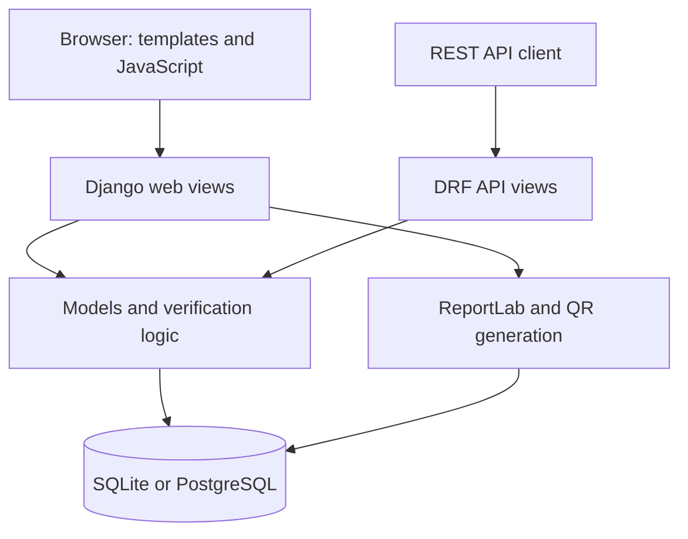

# MSU QVS: Current System Architecture

**Source baseline:** `0faeb043c8c2c602008b1c7e1d45eb29efdcd098`, reviewed on 10 September 2026.

## 1. Structure

The application is a Django monolith divided into apps. Presentation, application logic and persistence are logical layers within that application; they are not independently deployed microservices.



[settings.py](../backend/msu_qvs/settings.py) configures the database and middleware. [msu_qvs/urls.py](../backend/msu_qvs/urls.py) routes the web application, while [api/urls.py](../backend/api/urls.py) registers API resources.

## 2. Components and boundaries

| Component | Implemented responsibility |
| --- | --- |
| `authentication` | Custom users, session login, DRF token login, restricted public registration and application-role permissions |
| `students` | Student data, administrative list/create web views and a resource API |
| `qualifications` | Qualification definitions, one certificate per student, identifier/digest generation and certificate views |
| `verification` | Lookup, certificate-status interpretation, verification logs and PDF responses |
| `employers` | Company profiles and the signed-in user's screening history |
| `ai_fraud` | Fixed-rule anomaly scoring and summary metrics |
| `reports` | Role-directed dashboards, summary counts and CSV exports |
| `audit` | Middleware records of selected HTTP write requests |

The web interface uses session authentication. APIs support token and session authentication. Application roles are `ADMINISTRATOR`, `REGISTRAR`, `GRADUATE`, `EMPLOYER` and `PUBLIC_VERIFIER`. Django-admin staff/model permissions are separate from those role values.

Public registration permits only employer and public-verifier roles, invokes Django password validation and does not create privileged or graduate accounts. The login redirect validates its destination. These are the changes brought in through PR #6.

## 3. Verification processing

The shared `verify_qualification()` function searches certificate number, verification code, student number, national ID and partial name in that order. It returns the first certificate match, rather than a ranked or disambiguated result list.

The web view and API separately map the certificate state to an outcome and save a `VerificationLog`:

| Stored certificate status | Recorded result |
| --- | --- |
| `ACTIVE` | `VERIFIED` |
| `REVOKED` | `REVOKED` |
| `SUSPENDED` | `PENDING` |
| No matching certificate | `INVALID` |

The result is based on `Certificate.status`, not `Student.status`. Public lookups reveal matching personal/academic details. Name ambiguity, input validation and data-minimisation controls need further work.

The web template currently routes `PENDING` through its generic invalid/not-found display. A successful HTTP response or a “Safe” label does not override the recorded result or anomaly flag.

## 4. Digests, QR images and reports

When a certificate has no stored digest, `Certificate.save()` hashes:

```text
certificate_number:student_number:national_id:issue_date
```

The implementation uses SHA-256 without a signing key. It neither covers all award fields nor recomputes and compares the digest during verification. An existing digest is not automatically regenerated after field changes. Consequently, `digital_signature_hash` should be described as a stored digest, not a digital signature or an authenticity guarantee.

There are two QR-generation paths:

- `Certificate.qr_code_base64` produces an in-memory PNG data URI pointing at the fixed Vercel verification URL. Templates use this property.
- `generate_certificate_qr_code()` writes a PNG to media storage using the request origin, or localhost when no request is supplied. Verification/certificate views can invoke it if the image field is empty.

The scanner page opens a camera stream but contains no QR-decoding implementation. Its manual form passes identifiers to the verification view.

ReportLab produces PDF verification reports. Printable degree certificates are HTML with a browser print button. The PDF contains no cryptographic signature; its “tamper-evident” footer is an unimplemented claim. Reports regenerated for historical logs combine the stored outcome with current certificate/student data.

## 5. Heuristic scoring

[AIFraudDetector](../backend/ai_fraud/detector.py) applies fixed rules before the current request's log is inserted:

| Condition | Added score |
| --- | --- |
| Revoked certificate | 60 |
| Suspended certificate | 40 |
| More than 15 earlier logs from the IP in five minutes | 50 |
| Otherwise, more than 7 earlier logs from the IP in five minutes | 25 |
| No certificate for a certificate-number/verification-code search | 15 |
| User agent contains one of the configured automation markers | 20 |

The total is capped at 100 and `is_suspicious` becomes true at 40. This is deterministic rule-based scoring; no trained model, fraud-accuracy evaluation, automatic blocking or notification service is included. IP/user-agent inputs require trusted proxy handling and cannot establish identity by themselves.

## 6. Data and audit history

[UML_DIAGRAMS.md](UML_DIAGRAMS.md) shows the model relationships. Notable constraints include unique student number/national ID, optional user-to-student linkage and one certificate per student. `Student.qualification` is text; it is not a foreign key to `Qualification`.

Indexes exist on selected identifier/name fields. There is no performance benchmark proving that partial-name searches remain efficient at scale.

`VerificationLog` records processed web/API verification attempts. `AuditLogMiddleware` records POST/PUT/PATCH/DELETE metadata and response status, excluding static/media paths. It does not provide complete GET coverage, field-level change history, immutable storage or enforced retention. Existing audit models are registered in Django administration.

Certificate/student data and historical reports are mutable. No hash-chain, external log archive, backup scheduler or recovery automation is included.

## 7. Deployment and quality evidence

SQLite is the default backend. PostgreSQL is selected through individual `DB_*` variables; Compose specifies PostgreSQL 16 and Django's development server. There is no included reverse proxy or TLS termination configuration.

The Vercel entry point exposes the Django WSGI application. SQLite/media handling can use `/tmp`; it does not establish shared persistent storage. The code currently forces debug on outside `VERCEL=1`, allows all hosts through a wildcard and enables all CORS origins. Detailed configuration limits are in the [Installation Guide](INSTALLATION_GUIDE.md#deployment-status-and-remaining-work).

The Actions workflow performs system checks, migration-drift checks, pytest and a Docker image build. It does not implement linting, coverage measurement, dependency/security scanning, image publication or deployment. The 13 current tests cover selected authentication regressions, three verification lookup cases and a revoked-certificate scoring case.

The current model and configuration therefore support an academic prototype. High availability, scalability, tamper resistance, complete role/ownership controls and production security remain work to implement and verify.
