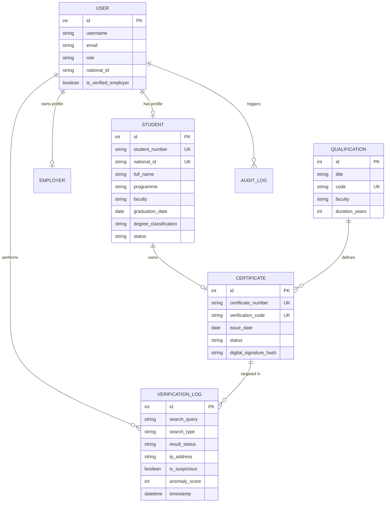
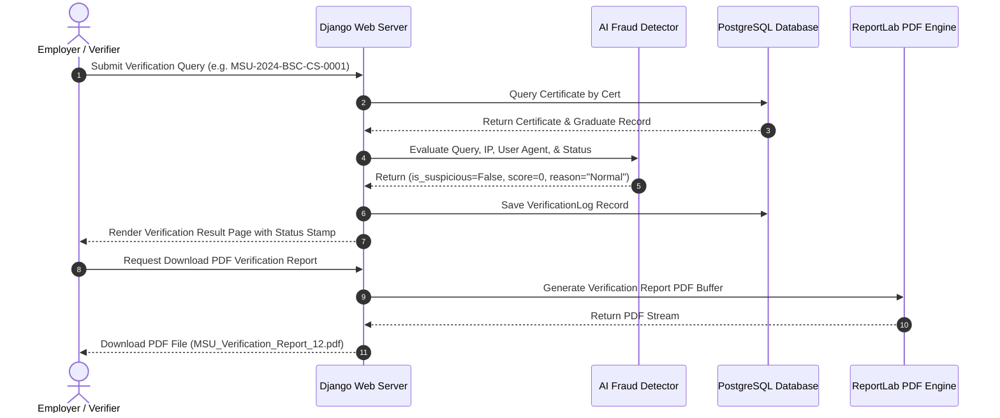
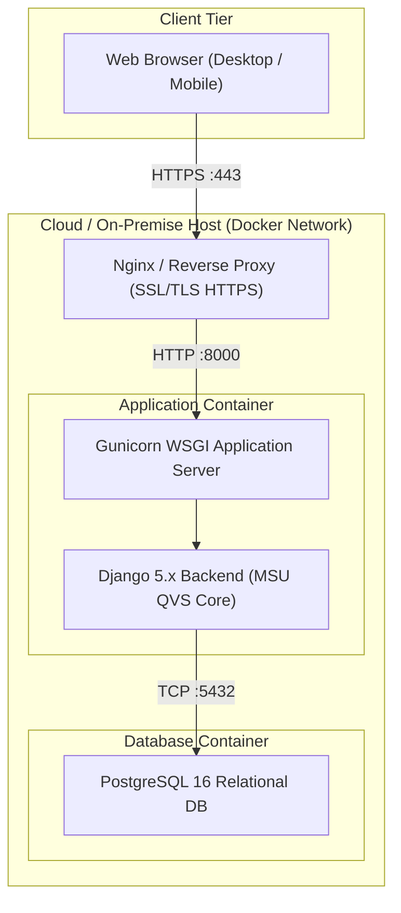

# Midlands State University QVS - System UML Diagrams

This document contains full Mermaid diagrams for all system models, software architecture, activity flows, and deployment topologies.

---

## 1. Entity-Relationship Diagram (ERD)

---

## 2. Use Case Diagram

```mermaid
graph TD
    PublicVerifier["Public Verifier"]
    Employer["Employer"]
    Graduate["Graduate"]
    Registrar["Registrar"]
    Admin["Administrator"]

    subgraph "MSU Qualification Verification System"
        UC1("Verify Certificate (Cert #, Student ID, QR Code)")
        UC2("Scan Certificate QR Code")
        UC3("Download PDF Verification Statement")
        UC4("Screen Candidates & View Verification History")
        UC5("Export Screening CSV Report")
        UC6("View Personal Digital Certificate")
        UC7("Register Graduate Student Record")
        UC8("Issue Digital Certificate & QR Code")
        UC9("Revoke / Suspend Certificate")
        UC10("Inspect AI Fraud Analytics")
        UC11("Manage System Users & Audit Logs")
    end

    PublicVerifier --> UC1
    PublicVerifier --> UC2
    PublicVerifier --> UC3

    Employer --> UC1
    Employer --> UC3
    Employer --> UC4
    Employer --> UC5

    Graduate --> UC6

    Registrar --> UC7
    Registrar --> UC8
    Registrar --> UC9
    Registrar --> UC10

    Admin --> UC7
    Admin --> UC9
    Admin --> UC10
    Admin --> UC11
```

---

## 3. Sequence Diagram (Verification Request & AI Threat Check)

---

## 4. Deployment Diagram

