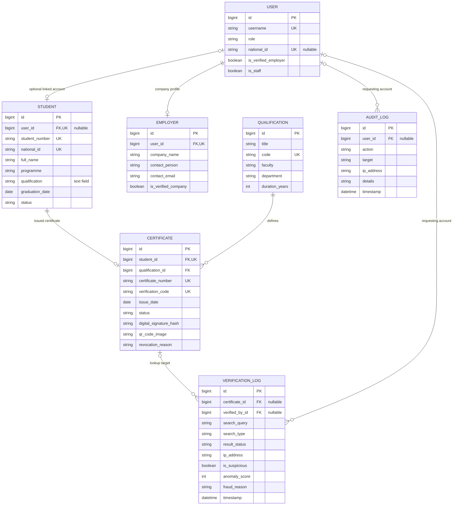
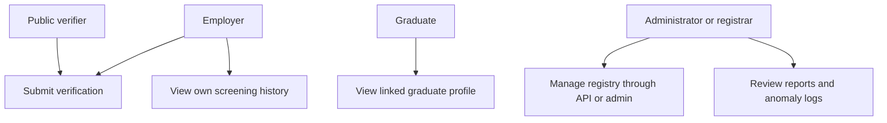
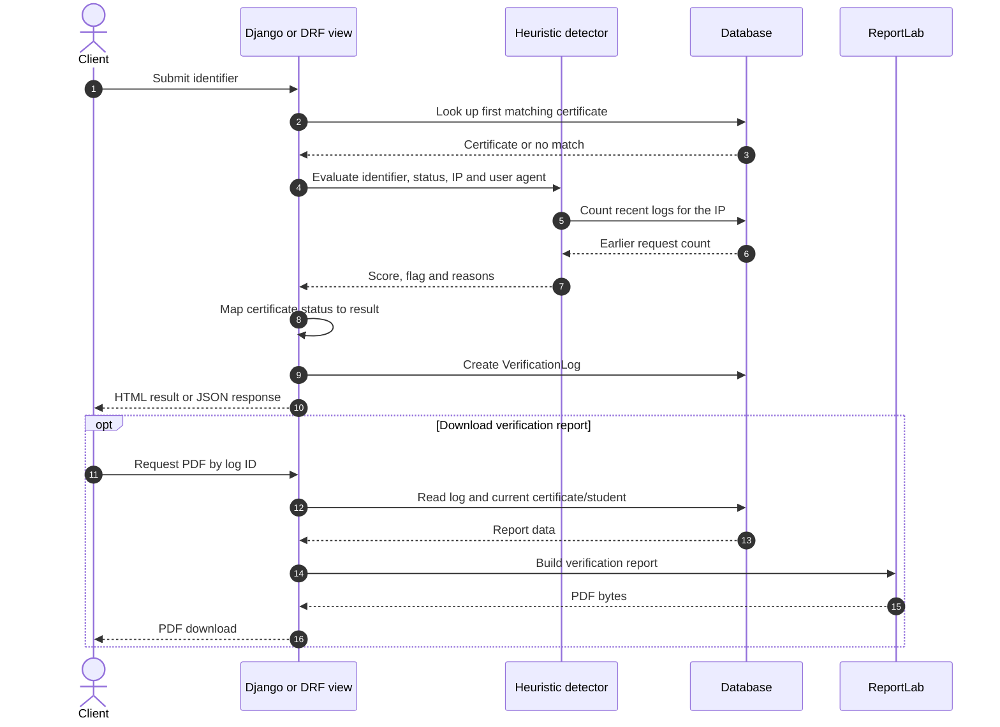
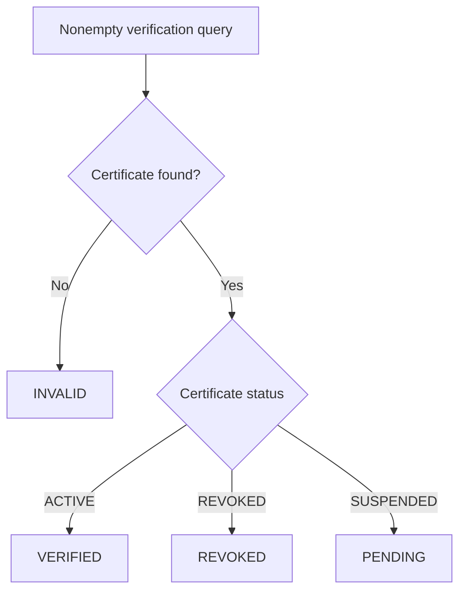
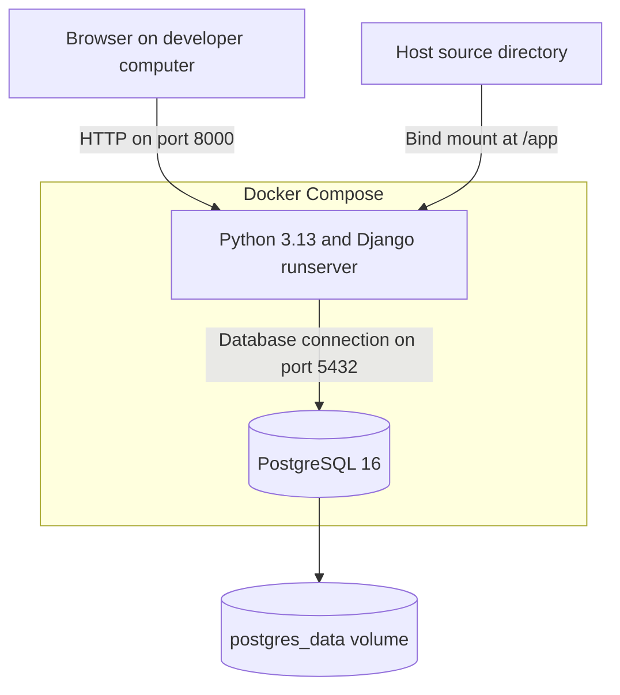

# MSU QVS: Data Model and System Diagrams

**Source baseline:** `0faeb043c8c2c602008b1c7e1d45eb29efdcd098`, reviewed on 10 September 2026.

These diagrams describe selected parts of the current implementation. They do not certify that all intended controls or deployment components are implemented.

## 1. Entity relationships

Fields below are selected model fields. Inherited Django authentication fields and some timestamps are omitted for readability.

A student may have no login account and no certificate. Each existing certificate requires one student and one qualification definition. `Student.qualification` is free text, so there is no direct student-to-qualification foreign key.

| Deleted object | Relationship behaviour |
| --- | --- |
| User | Linked student's user field and log user fields become null; an employer profile is deleted. |
| Student | Its certificate is deleted. |
| Certificate | Existing verification logs retain their other fields, with certificate set to null. |
| Qualification with certificates | Deletion is protected. |

These relationships are defined in the [student](../backend/students/models.py), [qualification/certificate](../backend/qualifications/models.py), [employer](../backend/employers/models.py), [verification-log](../backend/verification/models.py) and [audit-log](../backend/audit/models.py) models.

## 2. Principal user activities

This flowchart maps the main actors to supported tasks; it is a use-case overview, not a complete access-control model.

Django administration additionally requires staff/model permissions. The registry and certificate-detail web pages currently allow any logged-in account, and the PDF route has no authentication or ownership check. Those limits are documented in the [Administrator Manual](ADMINISTRATOR_MANUAL.md).

The scanner page offers camera preview and manual input; automated QR decoding is not represented as a completed use case.

## 3. Verification and PDF sequence

Web verification can additionally generate a stored QR image if one is absent. There is no signature-check step, and PDF generation does not create an immutable historical snapshot.

## 4. Result decision

This describes service behaviour. The current web template lacks a separate `PENDING` panel and displays its generic invalid/not-found result instead.

## 5. Included Docker development topology

The supplied Compose file also publishes the database port to the host. Its entrypoint runs migrations and demonstration seeding on startup. It does not include Gunicorn, a reverse proxy or TLS termination as running services.

The separate Vercel configuration exposes Django through `index.py`. Its temporary-file behaviour and remaining deployment work are described in the [Installation Guide](INSTALLATION_GUIDE.md#deployment-status-and-remaining-work).
